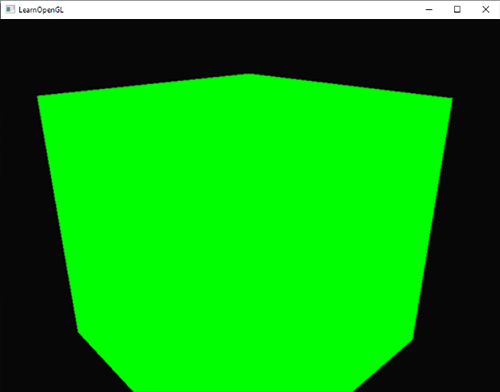
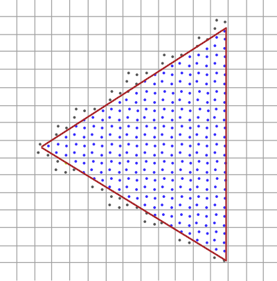
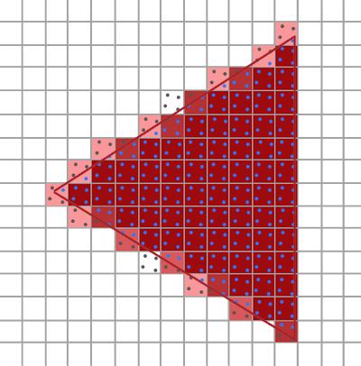
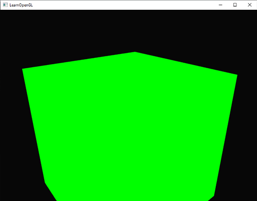
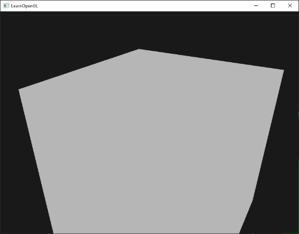

# 안티에일리어싱

렌더링 작업을 하다 보면 모델 가장자리에 톱니 모양의 들쭉날쭉한 패턴을 발견한 적이 있을 겁니다. 이러한 들쭉날쭉한 가장자리는 래스터라이저가 정점 데이터를 실제 프래그먼트로 변환하는 과정 때문에 발생합니다. 간단한 정육면체를 그릴 때 이러한 들쭉날쭉한 가장자리가 어떻게 보이는지 쉽게 확인할 수 있습니다.



당장 눈에 띄지는 않지만, 큐브의 모서리를 자세히 살펴보면 들쭉날쭉한 무늬를 발견할 수 있습니다. 확대해서 보면 다음과 같은 무늬가 나타납니다.


이는 최종 애플리케이션 버전에서 원치 않는 현상입니다. 가장자리를 구성하는 픽셀들이 명확하게 보이는 이러한 현상을 **에일리어싱**{:.g}이라고 합니다. 에일리어싱 현상을 방지하고 가장자리를 부드럽게 만드는 **안티에일리어싱**{:.g} 기법들이 많이 있습니다.

처음에 우리는 **슈퍼샘플링 안티에일리어싱(SSAA)**{:.g}이라는 기술을 사용했습니다. 이 기술은 장면을 렌더링할 때 일시적으로 훨씬 높은 해상도의 렌더 버퍼를 사용하는 방식입니다(슈퍼샘플링). 전체 장면 렌더링이 완료되면 해상도를 다시 정상 해상도로 다운샘플링합니다. 이 추가 해상도는 계단 현상을 방지하기 위해 사용되었습니다. 이 기술은 에일리어싱 문제를 해결해 주었지만, 평소보다 훨씬 많은 프래그먼트를 렌더링해야 하므로 성능 저하라는 심각한 단점이 있었습니다. 따라서 이 기술은 짧은 기간 동안만 효과를 발휘했습니다.

이 기술은 SSAA의 개념을 차용하면서 훨씬 효율적인 접근 방식을 구현하는 **멀티샘플 안티에일리어싱(MSAA)**{:.g}이라는 보다 현대적인 기술을 탄생시켰습니다. 이 장에서는 OpenGL에 내장된 MSAA 기술에 대해 자세히 살펴보겠습니다.

## 멀티샘플링

멀티샘플링이 무엇이고 어떻게 에일리어싱 문제를 해결하는지 이해하려면 먼저 OpenGL 래스터라이저의 내부 작동 방식을 좀 더 자세히 살펴볼 필요가 있습니다.

래스터라이저는 최종 처리된 정점과 프래그먼트 셰이더 사이에 있는 모든 알고리즘과 프로세스의 조합입니다. 래스터라이저는 하나의 기본 도형에 속하는 모든 정점을 가져와 이를 프래그먼트 집합으로 변환합니다. 정점 좌표는 이론적으로 어떤 좌표든 가질 수 있지만, 프래그먼트는 화면 해상도에 제약을 받기 때문에 임의의 좌표를 가질 수 없습니다. 정점 좌표와 프래그먼트 사이에는 거의 일대일 대응 관계가 없으므로, 래스터라이저는 각 특정 정점이 어떤 프래그먼트/화면 좌표에 위치하게 될지 결정해야 합니다.


여기서는 화면 픽셀 격자를 볼 수 있는데, 각 픽셀의 중심에는 픽셀이 삼각형에 의해 가려지는지 여부를 판단하는 데 사용되는 샘플 포인트가 있습니다. 빨간색 샘플 포인트는 삼각형에 의해 가려진 픽셀을 나타내며, 해당 픽셀에 대해 프래그먼트가 생성됩니다. 삼각형 가장자리의 일부가 특정 화면 픽셀에 들어가더라도, 해당 픽셀의 샘플 포인트가 삼각형 내부에 의해 가려지지 않으므로 이 픽셀은 어떤 프래그먼트 셰이더의 영향도 받지 않습니다.

아마 지금쯤이면 에일리어싱 현상의 원인을 이미 짐작하실 수 있을 겁니다. 화면에 삼각형이 완전히 렌더링된 모습은 다음과 같습니다.


화면 픽셀 수가 제한되어 있기 때문에 일부 픽셀은 가장자리를 따라 렌더링되고 일부는 그렇지 않습니다. 결과적으로 매끄럽지 않은 가장자리를 가진 기본 도형이 렌더링되어 이전에 보았던 들쭉날쭉한 가장자리가 나타납니다.

멀티샘플링이란 삼각형의 커버리지를 결정할 때 단일 샘플링 지점을 사용하는 것이 아니라 여러 개의 샘플링 지점을 사용하는 것을 말합니다(이름이 여기서 유래되었죠). 각 픽셀의 중심에 단일 샘플링 지점을 두는 대신, 일반적인 패턴으로 4개의 **서브샘플**{:.g}을 배치하고 이를 사용하여 픽셀 커버리지를 결정합니다.


이미지의 왼쪽은 삼각형의 영역을 일반적으로 판별하는 방법을 보여줍니다. 이 특정 픽셀은 샘플링된 지점이 삼각형에 포함되지 않았기 때문에 프래그먼트 셰이더가 실행되지 않고 (따라서 빈 화면으로 남게 됩니다). 이미지의 오른쪽은 각 픽셀에 4개의 샘플링 지점이 포함된 멀티샘플링된 버전을 보여줍니다. 여기서는 4개의 샘플링 지점 중 2개만 삼각형을 덮는 것을 확인할 수 있습니다.

!!! tip ""
    샘플 포인트 수는 원하는 만큼 설정할 수 있으며, 샘플 수가 많을수록 커버리지 정확도가 높아집니다.

여기서 멀티샘플링이 흥미로워집니다. 삼각형이 두 개의 서브샘플을 덮는다는 것을 확인했으므로 다음 단계는 이 특정 픽셀에 대한 색상을 결정하는 것입니다. 처음에는 덮인 각 서브샘플에 대해 프래그먼트 셰이더를 실행하고 나중에 각 서브샘플의 색상을 픽셀별로 평균화하는 방법을 생각했을 것입니다. 이 경우 각 서브샘플에서 보간된 정점 데이터에 대해 프래그먼트 셰이더를 두 번 실행하고 결과 색상을 해당 샘플 포인트에 저장하게 됩니다. 하지만 (다행히) 실제로는 그렇지 않습니다. 왜냐하면 이렇게 하면 멀티샘플링을 사용하지 않을 때보다 훨씬 더 많은 프래그먼트 셰이더를 실행해야 하므로 성능이 크게 저하되기 때문입니다.

MSAA의 실제 작동 방식은 삼각형이 커버하는 서브샘플 수와 관계없이 각 픽셀(각 프리미티브)에 대해 프래그먼트 셰이더가 한 번만 실행되는 것입니다. 프래그먼트 셰이더는 정점 데이터를 픽셀 중심으로 보간하여 실행합니다. 그런 다음 MSAA는 더 큰 깊이/스텐실 버퍼를 사용하여 서브샘플링 범위를 결정합니다. 커버되는 서브샘플 수는 픽셀 색상이 프레임 버퍼에 기여하는 정도를 결정합니다. 이전 이미지에서는 4개의 샘플 중 2개만 커버되었기 때문에 삼각형 색상의 절반이 프레임 버퍼 색상(이 경우 투명 색상)과 혼합되어 연한 푸른색을 띠게 됩니다.

!!! note ""
    쉽게 말하자면 색은 한번만 계산하고 기여도를 계산해서 색을 얼마나 진하게 표시할지 결정하는 것입니다.

그 결과, 모든 기본 모서리가 더 부드러운 패턴을 생성하는 더 높은 해상도의 버퍼(더 높은 해상도의 깊이/스텐실)가 생성됩니다. 이제 앞서 그린 삼각형의 커버리지를 결정할 때 멀티샘플링이 어떻게 작용하는지 살펴보겠습니다.



여기서 각 픽셀은 4개의 서브샘플(불필요한 샘플은 숨김)을 포함하며, 파란색 서브샘플은 삼각형에 포함되고 회색 샘플 포인트는 포함되지 않습니다. 삼각형 내부 영역의 모든 픽셀은 프래그먼트 셰이더를 한 번 실행하고, 그 색상 출력은 프레임버퍼에 직접 저장됩니다(블렌딩이 없다고 가정). 그러나 삼각형의 안쪽 가장자리에서는 모든 서브샘플이 포함되지 않으므로 프래그먼트 셰이더의 결과가 프레임버퍼에 완전히 반영되지 않습니다. 포함된 샘플 수에 따라 삼각형 프래그먼트의 색상 중 더 많거나 적은 양이 해당 픽셀에 표현됩니다.

각 픽셀에 대해 삼각형에 포함되는 부분 샘플이 적을수록 삼각형의 색상을 덜 차지하게 됩니다. 실제 픽셀 색상을 채워 넣으면 다음과 같은 이미지가 됩니다.



삼각형의 날카로운 모서리 부분은 이제 실제 모서리 색상보다 약간 밝은 색상으로 둘러싸여 있어 멀리서 볼 때 모서리가 매끄럽게 보입니다.

깊이 및 스텐실 값은 서브샘플별로 저장되며, 프래그먼트 셰이더는 한 번만 실행되지만, 여러 삼각형이 하나의 픽셀을 겹치는 경우를 대비하여 색상 값도 서브샘플별로 저장됩니다. 깊이 테스트의 경우, 정점의 깊이 값은 테스트를 실행하기 전에 각 서브샘플에 맞춰 보간되고, 스텐실 테스트의 경우 스텐실 값은 서브샘플별로 저장됩니다. 따라서 버퍼 크기는 픽셀당 서브샘플 수만큼 증가합니다.

지금까지 살펴본 내용은 멀티샘플링 안티에일리어싱이 내부적으로 어떻게 작동하는지에 대한 기본적인 개요입니다. 래스터라이저의 실제 로직은 조금 더 복잡하지만, 이 간략한 설명만으로도 멀티샘플링 안티에일리어싱의 개념과 로직을 이해하고 실질적인 측면으로 나아가기에 충분할 것입니다.

## OpenGL에서의 MSAA

OpenGL에서 MSAA를 사용하려면 픽셀당 여러 개의 샘플 값을 저장할 수 있는 버퍼가 필요합니다. 즉, 주어진 개수의 멀티샘플을 저장할 수 있는 새로운 유형의 버퍼가 필요한데, 이를 **멀티샘플 버퍼**{:.g}라고 합니다.

대부분의 윈도우 시스템은 기본 버퍼 대신 멀티샘플 버퍼를 제공할 수 있습니다. GLFW 또한 이 기능을 제공하며, 윈도우를 생성하기 전에 `glfwWindowHint`를 호출하여 일반 버퍼 대신 N개의 샘플을 가진 멀티샘플 버퍼를 사용하고 싶다고 GLFW에 알려주기만 하면 됩니다.

```c++
glfwWindowHint(GLFW_SAMPLES, 4);
```

이제 `glfwCreateWindow`를 호출하면 렌더링 창이 생성되지만, 이번에는 화면 좌표당 4개의 서브샘플을 포함하는 버퍼가 사용됩니다. 즉, 버퍼 크기가 4만큼 증가합니다.

이제 GLFW에 멀티샘플링된 버퍼를 요청했으므로 `glEnable` 함수를 `GL_MULTISAMPLE`과 함께 호출하여 멀티샘플링을 활성화해야 합니다. 대부분의 OpenGL 드라이버에서는 멀티샘플링이 기본적으로 활성화되어 있으므로 이 호출은 다소 불필요해 보일 수 있지만, 어쨌든 활성화하는 것이 좋습니다. 이렇게 하면 모든 OpenGL 구현에서 멀티샘플링이 활성화됩니다.

```c++
glEnable(GL_MULTISAMPLE);  
```

실제 멀티샘플링 알고리즘은 OpenGL 드라이버의 래스터라이저에 구현되어 있으므로 우리가 추가로 해야 할 일은 많지 않습니다. 이제 이 장의 시작 부분에 나왔던 녹색 큐브를 렌더링해 보면 가장자리가 더 부드러워진 것을 확인할 수 있을 것입니다.



큐브가 훨씬 더 매끄럽게 보이는 것은 확실하며, 장면에 그리는 다른 모든 객체에도 동일하게 적용됩니다. 이 간단한 예제의 소스 코드는 [여기](https://github.com/JoeyDeVries/LearnOpenGL/blob/master/src/4.advanced_opengl/11.1.anti_aliasing_msaa/anti_aliasing_msaa.cpp)에서 확인할 수 있습니다.

## 오프스크린 MSAA

GLFW는 멀티샘플링 버퍼 생성을 자동으로 처리하기 때문에 MSAA를 활성화하는 것은 매우 쉽습니다. 하지만 자체 프레임 버퍼를 사용하려면 멀티샘플링 버퍼를 직접 생성해야 합니다. 즉, 멀티샘플링 버퍼 생성 과정을 직접 처리해야 합니다.

프레임버퍼에 대한 어태치먼트로 사용할 멀티샘플링 버퍼를 생성하는 방법에는 텍스처 어태치먼트와 렌더버퍼 어태치먼트, 이렇게 두 가지가 있습니다. 이는 프레임버퍼 챕터에서 다룬 일반적인 어태치먼트와 매우 유사합니다.

### 멀티샘플링된 텍스처 어태치먼트

여러 샘플 포인트를 저장할 수 있는 텍스처를 생성하기 위해 텍스처 대상으로 `GL_TEXTURE_2D_MULTISAPLE`을 허용하는 `glTexImage2D` 대신 `glTexImage2DMultisample`을 사용합니다.

```c++
glBindTexture(GL_TEXTURE_2D_MULTISAMPLE, tex);
glTexImage2DMultisample(GL_TEXTURE_2D_MULTISAMPLE, samples, GL_RGB, width, height, GL_TRUE);
glBindTexture(GL_TEXTURE_2D_MULTISAMPLE, 0); 
```

두 번째 인수는 텍스처에 사용할 샘플 수를 설정합니다. 마지막 인수를 GL_TRUE로 설정하면 이미지는 각 텍셀에 대해 동일한 샘플 위치와 동일한 수의 서브샘플을 사용합니다.

프레임버퍼에 멀티샘플링된 텍스처를 연결하려면 `glFramebufferTexture2D`를 사용하는데, 이때 텍스처 유형으로 `GL_TEXTURE_2D_MULTISAMPLE`을 지정합니다.

```c++
glFramebufferTexture2D(GL_FRAMEBUFFER, GL_COLOR_ATTACHMENT0, GL_TEXTURE_2D_MULTISAMPLE, tex, 0); 
```

현재 바인딩된 프레임 버퍼에는 텍스처 이미지 형태의 멀티샘플링된 컬러 버퍼가 있습니다.

### 멀티샘플링된 렌더버퍼 객체

텍스처와 마찬가지로 멀티샘플링된 렌더버퍼 객체를 생성하는 것은 어렵지 않습니다. 현재 바인딩된 렌더버퍼의 메모리 저장소를 구성할 때 `glRenderbufferStorage`를 `glRenderbufferStorageMultisample`로 변경하기만 하면 되므로 매우 간단합니다.

```c++
glRenderbufferStorageMultisample(GL_RENDERBUFFER, 4, GL_DEPTH24_STENCIL8, width, height);  
```

여기서 달라진 점은 사용할 샘플 수를 설정하는 두 번째 매개변수가 추가되었다는 것입니다. 이 경우에는 4개입니다.

### 멀티샘플링된 프레임버퍼에 렌더링하기

멀티샘플링된 프레임버퍼에 렌더링하는 것은 간단합니다. 프레임버퍼 객체가 바인딩된 상태에서 무엇을 그리든, 래스터라이저가 모든 멀티샘플링 연산을 처리합니다. 하지만 멀티샘플링된 버퍼는 다소 특수한 형태이기 때문에 셰이더에서 샘플링하는 등의 다른 연산에 직접 사용할 수는 없습니다.

멀티샘플링된 이미지는 일반 이미지보다 훨씬 더 많은 정보를 포함하고 있으므로, 이미지를 축소하거나 해상도를 **높여야(resolve)**{:.g} 합니다. 멀티샘플링된 프레임버퍼의 해상도 조정은 일반적으로 `glBlitFramebuffer` 함수를 통해 이루어지는데, 이 함수는 한 프레임버퍼의 영역을 다른 프레임버퍼로 복사하는 동시에 멀티샘플링된 버퍼를 해상도 조정합니다.

`glBlitFramebuffer` 함수는 4개의 화면 공간 좌표로 정의된 **소스**{:.g} 영역을 역시 4개의 화면 공간 좌표로 정의된 **대상**{:.g} 영역으로 전송합니다. 프레임버퍼에 대한 설명에서 기억하시겠지만, `GL_FRAMEBUFFER`에 바인딩하면 읽기 및 그리기 프레임버퍼 대상 모두에 바인딩됩니다. `GL_READ_FRAMEBUFFER`와 `GL_DRAW_FRAMEBUFFER`에 각각 프레임버퍼를 바인딩하여 개별적으로 바인딩할 수도 있습니다. `glBlitFramebuffer` 함수는 이 두 대상에서 값을 읽어 소스 프레임버퍼와 대상 프레임버퍼를 결정합니다. 그런 다음 다음과 같이 기본 프레임버퍼에 이미지를 **블리팅(blitting)**{:.g}하여 멀티샘플링된 프레임버퍼 출력을 실제 화면에 표시할 수 있습니다.

```c++
glBindFramebuffer(GL_READ_FRAMEBUFFER, multisampledFBO);
glBindFramebuffer(GL_DRAW_FRAMEBUFFER, 0);
glBlitFramebuffer(0, 0, width, height, 0, 0, width, height, GL_COLOR_BUFFER_BIT, GL_NEAREST); 
```

같은 애플리케이션을 렌더링하면 동일한 결과가 나타납니다. MSAA가 적용된 연두색 큐브가 표시되고, 가장자리의 계단 현상이 훨씬 줄어든 것을 확인할 수 있습니다.


소스 코드는 [여기](https://github.com/JoeyDeVries/LearnOpenGL/blob/master/src/4.advanced_opengl/11.2.anti_aliasing_offscreen/anti_aliasing_offscreen.cpp)에서 찾을 수 있습니다.

하지만 멀티샘플링된 프레임버퍼의 텍스처 결과를 후처리 같은 작업에 사용하고 싶다면 어떻게 해야 할까요? 프래그먼트 셰이더에서 멀티샘플링된 텍스처를 직접 사용할 수는 없습니다. 하지만 멀티샘플링된 버퍼를 일반 텍스처가 부착된 다른 FBO(프레임버퍼 객체)로 블릿(blit)할 수 있습니다. 그런 다음 이 일반 컬러 텍스처를 후처리에 사용하여 멀티샘플링으로 렌더링된 이미지를 효과적으로 후처리할 수 있습니다. 즉, 멀티샘플링된 버퍼를 프래그먼트 셰이더에서 사용할 수 있는 일반 2D 텍스처로 변환하는 중간 프레임버퍼 객체 역할을 하는 새로운 FBO를 생성해야 합니다. 이 과정을 의사 코드로 나타내면 다음과 같습니다.

```c++
unsigned int msFBO = CreateFBOWithMultiSampledAttachments();
// 그런 다음 일반 텍스처 색상 어태치먼트가 있는 다른 FBO를 생성합니다.
[...]
glFramebufferTexture2D(GL_FRAMEBUFFER, GL_COLOR_ATTACHMENT0, GL_TEXTURE_2D, screenTexture, 0);
[...]
while(!glfwWindowShouldClose(window))
{
    [...]
    
    glBindFramebuffer(msFBO);
    ClearFrameBuffer();
    DrawScene();
    // 이제 멀티샘플링된 버퍼를 중간 FBO로 변환합니다.
    glBindFramebuffer(GL_READ_FRAMEBUFFER, msFBO);
    glBindFramebuffer(GL_DRAW_FRAMEBUFFER, intermediateFBO);
    glBlitFramebuffer(0, 0, width, height, 0, 0, width, height, GL_COLOR_BUFFER_BIT, GL_NEAREST);
    // 이제 장면이 2D 텍스처 이미지로 저장되었으므로 해당 이미지를 후처리합니다.
    glBindFramebuffer(GL_FRAMEBUFFER, 0);
    ClearFramebuffer();
    glBindTexture(GL_TEXTURE_2D, screenTexture);
    DrawPostProcessingQuad();  
  
    [...] 
}
```

이 기능을 프레임버퍼 챕터의 후처리 코드에 적용하면 (거의) 들쭉날쭉한 가장자리 없이 장면의 텍스처에 다양한 멋진 후처리 효과를 적용할 수 있습니다. 회색조 후처리 필터를 적용하면 다음과 같은 결과가 나타납니다.



!!! tip ""
    화면 텍스처가 일반적인(멀티샘플링되지 않은) 텍스처이기 때문에, 에지 검출(edge-detection)과 같은 일부 후처리 필터는 다시 들쭉날쭉한 가장자리를 만들어낼 수 있습니다. 이를 해결하려면 텍스처를 나중에 흐리게 처리하거나 자체적인 앤티에일리어싱 알고리즘을 만들 수 있습니다.

보시다시피 멀티샘플링과 오프스크린 렌더링을 결합하려면 몇 가지 추가 단계를 거쳐야 합니다. 하지만 멀티샘플링은 장면의 시각적 품질을 크게 향상시키므로 이러한 추가 노력은 충분히 가치가 있습니다. 멀티샘플링을 활성화하면 사용하는 샘플 수가 많아질수록 성능이 눈에 띄게 저하될 수 있다는 점에 유의하십시오.

## 사용자 지정 안티에일리어싱 알고리즘

GLSL을 사용하면 텍스처 이미지를 먼저 해상도를 높이는 과정 없이 멀티샘플링된 텍스처 이미지를 프래그먼트 셰이더에 직접 전달할 수 있습니다. 또한, 서브샘플링 단위로 텍스처 이미지를 샘플링할 수 있는 옵션을 제공하여 사용자 지정 안티에일리어싱 알고리즘을 구현할 수 있습니다.

서브샘플별 텍스처 값을 얻으려면 일반적인 sampler2D 대신 sampler2DMS로 텍스처 균일 샘플러를 정의해야 합니다.

```glsl
uniform sampler2DMS screenTextureMS;    
```

texelFetch 함수를 사용하면 샘플별 색상 값을 가져올 수 있습니다.

```glsl
vec4 colorSample = texelFetch(screenTextureMS, TexCoords, 3);  // 4th subsample
```

여기서는 사용자 지정 안티에일리어싱 기법을 만드는 자세한 내용은 다루지 않겠지만, 이 정도면 직접 만들어보는 데 도움이 될 수 있을 것입니다.