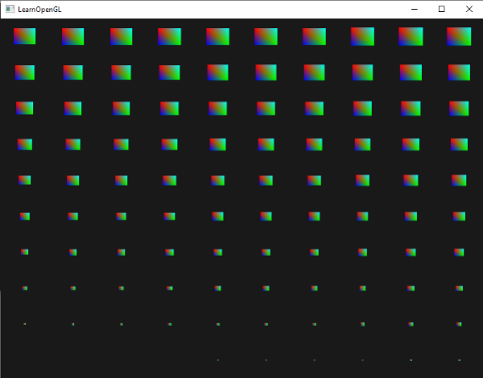
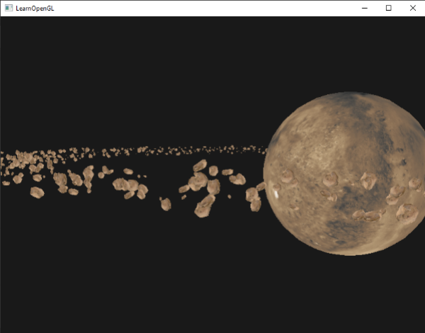
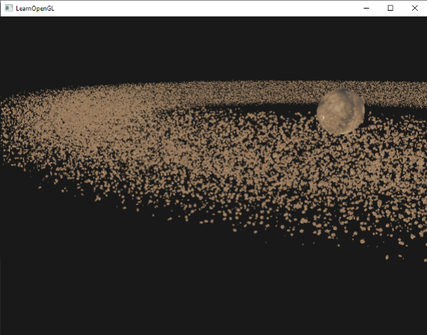

# 인스턴싱

대부분의 모델이 동일한 정점 데이터를 가지고 있지만 월드 변환이 서로 다른 수많은 모델을 렌더링하는 장면을 생각해 보세요. 예를 들어, 풀잎으로 가득 찬 장면을 떠올려 보면, 각 풀잎은 몇 개의 삼각형으로 이루어진 작은 모델입니다. 아마도 상당히 많은 풀잎을 렌더링해야 할 것이고, 장면에는 매 프레임마다 렌더링해야 하는 수천 개 또는 수만 개의 풀잎이 있을 수 있습니다. 각 잎은 몇 개의 삼각형으로만 구성되어 있기 때문에 거의 즉시 렌더링됩니다. 그러나 수천 번의 렌더링 호출은 성능을 급격히 저하시킬 것입니다.

만약 실제로 그렇게 많은 객체를 렌더링한다면 코드로는 대략 다음과 같은 모습이 될 것입니다.

```c++
for(unsigned int i = 0; i < amount_of_models_to_draw; i++)
{
    DoSomePreparations(); // VAO 바인딩, 텍스처 바인딩, 유니폼 설정 등
    glDrawArrays(GL_TRIANGLES, 0, amount_of_vertices);
}
```

이처럼 모델의 **인스턴스(instances)**{:.g}를 여러 개 생성하면 드로우 콜이 많아져 성능 병목 현상이 빠르게 발생합니다. 실제 정점을 렌더링하는 것과 비교했을 때, `glDrawArrays`나 `glDrawElements` 같은 함수를 사용하여 GPU에 정점 데이터를 렌더링하도록 지시하는 과정은 상당한 성능 저하를 초래합니다. OpenGL은 정점 데이터를 렌더링하기 전에 필요한 준비 작업을 수행해야 하기 때문입니다 (예: GPU에 데이터를 읽을 버퍼 위치, 정점 속성 위치 등을 알려주는 작업). 이러한 모든 작업은 상대적으로 느린 CPU-GPU 버스를 통해 이루어집니다. 따라서 정점 렌더링 자체는 매우 빠르지만, GPU에 정점 렌더링 명령을 전달하는 과정은 그렇지 않습니다.

데이터를 GPU로 한 번만 전송한 다음, 단일 드로잉 호출로 OpenGL에 해당 데이터를 사용하여 여러 객체를 그리도록 지시할 수 있다면 훨씬 편리할 것입니다. 바로 **인스턴싱(instancing)**이 그 해답입니다.

인스턴싱은 여러 객체(동일한 메시 데이터)를 한 번에 렌더링하는 기술로, 단일 렌더링 호출을 통해 CPU와 GPU 간의 매번의 통신을 줄여줍니다. 인스턴싱을 사용하여 렌더링하려면 `glDrawArrays`와 `glDrawElements` 렌더링 함수를 각각 `glDrawArraysInstanced`와 `glDrawElementsInstanced`로 변경하기만 하면 됩니다. 이러한 인스턴스화된 렌더링 함수는 기존 함수의 인스턴스 개수를 지정하는 **instance count**{:.g}라는 추가 매개변수를 받습니다. 필요한 모든 데이터를 GPU에 한 번만 전송하고, GPU에 이러한 모든 인스턴스를 어떻게 렌더링할지 한 번의 호출로 알려줍니다. 그러면 GPU는 CPU와 지속적으로 통신할 필요 없이 모든 인스턴스를 렌더링합니다.

이 함수 자체만으로는 그다지 유용하지 않습니다. 동일한 객체를 천 번 렌더링하는 것은 아무런 의미가 없습니다. 렌더링되는 모든 객체가 정확히 동일하게, 그리고 동일한 위치에 렌더링되기 때문입니다. 결국 우리는 하나의 객체만 보게 될 것입니다! 이러한 이유로 GLSL은 정점 셰이더에 `gl_InstanceID`라는 내장 변수를 추가했습니다.

인스턴스 렌더링 호출 중 하나를 사용하여 그림을 그릴 때, `gl_InstanceID`는 렌더링되는 각 인스턴스마다 0부터 시작하여 증가합니다. 예를 들어 43번째 인스턴스를 렌더링하는 경우, 정점 셰이더에서 `gl_InstanceID`는 42라는 값을 갖게 됩니다. 인스턴스마다 고유한 값을 가지므로, 예를 들어 위치 값으로 이루어진 큰 배열에 인덱싱하여 각 인스턴스를 월드 상의 서로 다른 위치에 배치할 수 있습니다.

인스턴스화된 드로잉을 이해하기 위해, 단 한 번의 렌더링 호출로 100개의 2D 사각형을 정규화된 장치 좌표계에 렌더링하는 간단한 예제를 보여드리겠습니다. 이를 위해 100개의 오프셋 벡터로 구성된 유니폼 배열을 인덱싱하여 각 인스턴스화된 사각형의 위치를 ​​고유하게 지정합니다. 결과적으로 창 전체를 채우는 깔끔하게 정렬된 사각형 격자가 생성됩니다.


각 사각형은 총 6개의 정점을 가진 2개의 삼각형으로 구성됩니다. 각 정점에는 2D NDC 위치 벡터와 색상 벡터가 포함되어 있습니다. 아래는 이 예제에 사용된 정점 데이터입니다. 삼각형은 100개가 있을 때 화면에 제대로 맞도록 충분히 작게 설계되었습니다.

```c++
float quadVertices[] = {
    // positions     // colors
    -0.05f,  0.05f,  1.0f, 0.0f, 0.0f,
     0.05f, -0.05f,  0.0f, 1.0f, 0.0f,
    -0.05f, -0.05f,  0.0f, 0.0f, 1.0f,

    -0.05f,  0.05f,  1.0f, 0.0f, 0.0f,
     0.05f, -0.05f,  0.0f, 1.0f, 0.0f,   
     0.05f,  0.05f,  0.0f, 1.0f, 1.0f
};
```

사각형들은 정점 셰이더에서 색상 벡터를 받아 출력으로 설정하는 프래그먼트 셰이더에서 색칠됩니다.

```glsl
#version 330 core
out vec4 FragColor;
  
in vec3 fColor;

void main()
{
    FragColor = vec4(fColor, 1.0);
}
```

아직까지는 새로운 내용은 없지만, 정점 셰이더 부분에서 흥미로운 일이 벌어지기 시작했습니다.

```glsl
#version 330 core
layout (location = 0) in vec2 aPos;
layout (location = 1) in vec3 aColor;

out vec3 fColor;

uniform vec2 offsets[100];

void main()
{
    vec2 offset = offsets[gl_InstanceID];
    gl_Position = vec4(aPos + offset, 0.0, 1.0);
    fColor = aColor;
}  
```

여기서는 총 100개의 오프셋 벡터를 포함하는 offsets라는 유니폼 배열을 정의했습니다. 정점 셰이더 내에서 `gl_InstanceID`를 사용하여 offsets 배열의 인덱싱을 통해 각 인스턴스에 대한 오프셋 벡터를 가져옵니다. 이제 인스턴스 드로잉으로 100개의 쿼드를 그리면 서로 다른 위치에 100개의 쿼드가 배치됩니다.

렌더링 루프에 들어가기 전에 중첩된 for 루프에서 계산한 오프셋 위치를 실제로 설정해야 합니다.

```c++
glm::vec2 translations[100];
int index = 0;
float offset = 0.1f;
for(int y = -10; y < 10; y += 2)
{
    for(int x = -10; x < 10; x += 2)
    {
        glm::vec2 translation;
        translation.x = (float)x / 10.0f + offset;
        translation.y = (float)y / 10.0f + offset;
        translations[index++] = translation;
    }
}  
```

여기서는 10x10 그리드의 모든 위치에 대한 오프셋 벡터를 포함하는 100개의 변환 벡터 세트를 생성합니다. 변환 배열을 생성하는 것 외에도, 해당 데이터를 정점 셰이더의 유니폼 배열로 전달해야 합니다.

```c++
shader.use();
for(unsigned int i = 0; i < 100; i++)
{
    shader.setVec2(("offsets[" + std::to_string(i) + "]")), translations[i]);
}  
```

이 코드 조각에서는 for 루프 카운터 i를 문자열로 변환하여 유니폼 위치를 조회하기 위한 위치 문자열을 동적으로 생성합니다. 그런 다음 오프셋 유니폼 배열의 각 항목에 해당하는 변환 벡터를 설정합니다.

이제 모든 준비가 완료되었으므로 사각형 렌더링을 시작할 수 있습니다. 인스턴스 렌더링을 통해 그리려면 `glDrawArraysInstanced` 또는 `glDrawElementsInstanced`를 호출합니다. 요소 인덱스 버퍼를 사용하지 않으므로 `glDrawArrays` 버전을 호출하겠습니다.

```c++
glBindVertexArray(quadVAO);
glDrawArraysInstanced(GL_TRIANGLES, 0, 6, 100);  
```

`glDrawArraysInstanced` 함수의 매개변수는 마지막 매개변수를 제외하고는 `glDrawArrays` 함수와 완전히 동일합니다. 마지막 매개변수는 그릴 사각형의 개수를 설정합니다. 10x10 그리드에 100개의 사각형을 표시하려고 하므로 이 값을 100으로 설정합니다. 이제 코드를 실행하면 100개의 다채로운 사각형으로 이루어진 익숙한 이미지가 나타날 것입니다.

## 인스턴스 배열

이전 구현 방식은 특정 사용 사례에서는 잘 작동하지만, 100개 이상의 인스턴스를 렌더링하는 경우(이는 매우 흔한 경우입니다) 셰이더로 전송할 수 있는 유니폼 데이터 양에 한계가 생깁니다. 대안 중 하나는 **인스턴스 배열(instanced arrays)**{:.g}을 사용하는 것입니다. 인스턴스 배열은 정점 속성으로 정의되며(훨씬 더 많은 데이터를 저장할 수 있음), 정점 단위가 아닌 인스턴스 단위로 업데이트됩니다.

정점 속성을 사용할 경우, 정점 셰이더가 실행될 때마다 GPU는 현재 정점에 해당하는 다음 정점 속성 세트를 가져옵니다. 하지만 정점 속성을 인스턴스 배열로 정의하면, 정점 셰이더는 인스턴스별로만 정점 속성 내용을 업데이트합니다. 이를 통해 정점별 데이터에는 표준 정점 속성을 사용하고, 인스턴스별로 고유한 데이터에는 인스턴스 배열을 사용할 수 있습니다.

인스턴스 배열의 예를 보여드리기 위해 이전 예제를 가져와 오프셋 유니폼 배열을 인스턴스 배열로 변환해 보겠습니다. 이를 위해서는 정점 셰이더에 새로운 정점 속성을 추가하여 업데이트해야 합니다.

```glsl
#version 330 core
layout (location = 0) in vec2 aPos;
layout (location = 1) in vec3 aColor;
layout (location = 2) in vec2 aOffset;

out vec3 fColor;

void main()
{
    gl_Position = vec4(aPos + aOffset, 0.0, 1.0);
    fColor = aColor;
}  
```

이제 `gl_InstanceID`를 사용하지 않고, 먼저 큰 균일 배열에 인덱싱하지 않고도 offset 속성을 직접 사용할 수 있습니다.

인스턴스화된 배열은 위치 및 색상 변수와 마찬가지로 정점 속성이므로 해당 내용을 정점 버퍼 객체에 저장하고 속성 포인터를 구성해야 합니다. 먼저 이전 섹션에서 만든 변환 배열을 새 버퍼 객체에 저장하겠습니다.

```c++
unsigned int instanceVBO;
glGenBuffers(1, &instanceVBO);
glBindBuffer(GL_ARRAY_BUFFER, instanceVBO);
glBufferData(GL_ARRAY_BUFFER, sizeof(glm::vec2) * 100, &translations[0], GL_STATIC_DRAW);
glBindBuffer(GL_ARRAY_BUFFER, 0); 
```

다음으로 정점 속성 포인터를 설정하고 정점 속성을 활성화해야 합니다.

```c++
glEnableVertexAttribArray(2);
glBindBuffer(GL_ARRAY_BUFFER, instanceVBO);
glVertexAttribPointer(2, 2, GL_FLOAT, GL_FALSE, 2 * sizeof(float), (void*)0);
glBindBuffer(GL_ARRAY_BUFFER, 0);	
glVertexAttribDivisor(2, 1);  
```

이 코드에서 흥미로운 부분은 마지막 줄에서 `glVertexAttribDivisor` 함수를 호출하는 것입니다. 이 함수는 OpenGL에게 정점 속성의 내용을 다음 요소로 업데이트할 시점을 알려줍니다. 첫 번째 매개변수는 해당 정점 속성이고, 두 번째 매개변수는 속성 제수입니다. 기본적으로 속성 제수는 0이며, 이는 OpenGL에게 정점 셰이더의 각 반복마다 정점 속성의 내용을 업데이트하도록 지시합니다. 이 속성을 1로 설정하면 새로운 인스턴스를 렌더링할 때마다 정점 속성의 내용을 업데이트하도록 OpenGL에 알리는 것입니다. 2로 설정하면 2개의 인스턴스마다 내용을 업데이트하는 식입니다. 속성 제수를 1로 설정하면 사실상 OpenGL에게 속성 위치 2에 있는 정점 속성이 인스턴스 배열임을 알려주는 것입니다.

이제 `glDrawArraysInstanced`를 사용하여 사각형을 다시 렌더링하면 다음과 같은 출력을 얻게 됩니다.


이것은 이전 예제와 완전히 동일하지만, 인스턴스 배열을 사용하므로 인스턴스화된 드로잉을 위해 정점 셰이더에 훨씬 더 많은 데이터(메모리가 허용하는 한도 내에서)를 전달할 수 있습니다.

재미 삼아 `gl_InstanceID`를 다시 사용하여 오른쪽 상단에서 왼쪽 하단으로 각 사각형의 크기를 천천히 줄여볼 수도 있습니다. 왜 안 되겠어요?

```glsl
void main()
{
    vec2 pos = aPos * (gl_InstanceID / 100.0);
    gl_Position = vec4(pos + aOffset, 0.0, 1.0);
    fColor = aColor;
} 
```

그 결과, 사각형의 초기 인스턴스는 매우 작게 그려지고, 인스턴스를 그리는 과정이 진행될수록 gl_InstanceID가 100에 가까워지면서 사각형은 원래 크기를 되찾게 됩니다. 이처럼 인스턴스 배열과 gl_InstanceID를 함께 사용하는 것은 완전히 합법적입니다.



인스턴스 렌더링이 어떻게 작동하는지 아직 잘 모르시거나 모든 요소가 어떻게 통합되는지 확인하고 싶으시다면, [여기](https://github.com/JoeyDeVries/LearnOpenGL/blob/master/src/4.advanced_opengl/10.1.instancing_quads/instancing_quads.cpp)에서 애플리케이션의 전체 소스 코드를 찾아보실 수 있습니다.

재미있긴 하지만, 이 예시들은 인스턴싱의 진정한 매력을 보여주는 좋은 예시는 아닙니다. 물론 인스턴싱이 어떻게 작동하는지 쉽게 이해할 수 있게 해주지만, 인스턴싱의 진가는 비슷한 객체를 대량으로 그릴 때 발휘됩니다. 그래서 우리는 우주로 나아가 보려고 합니다.

## 소행성 지대

거대한 행성 하나가 거대한 소행성 고리의 중심에 있는 장면을 상상해 보세요. 이러한 소행성 고리는 수천, 수만 개의 암석 지형으로 구성될 수 있으며, 웬만한 그래픽 카드로는 렌더링이 불가능할 정도입니다. 이러한 시나리오에서는 인스턴스 렌더링이 특히 유용합니다. 모든 소행성을 하나의 모델로 표현할 수 있기 때문입니다. 각 소행성은 고유한 변환 행렬을 통해 각기 다른 형태로 표현됩니다.

인스턴스 렌더링의 효과를 보여주기 위해 먼저 인스턴스 렌더링을 사용하지 않고 행성 주위를 떠다니는 소행성 장면을 렌더링해 보겠습니다. 이 장면에는 [여기](https://learnopengl.com/data/models/planet.zip)에서 다운로드할 수 있는 대형 행성 모델과 행성 주위에 적절하게 배치된 여러 개의 소행성 암석이 포함됩니다. 소행성 암석 모델은 [여기](https://learnopengl.com/data/models/rock.zip)에서 다운로드할 수 있습니다.

코드 예제에서는 모델 로딩 장에서 이전에 정의한 모델 로더를 사용하여 모델을 로드합니다.

원하는 효과를 얻기 위해 각 소행성에 대한 모델 변환 행렬을 생성할 것입니다. 변환 행렬은 먼저 소행성을 소행성 고리 내의 특정 위치로 이동시킨 다음, 고리가 더욱 자연스럽게 보이도록 이동 위치에 작은 무작위 변위 값을 추가합니다. 그 후 무작위 크기 조정과 무작위 회전을 적용합니다. 결과적으로 각 소행성이 행성 주위의 특정 위치로 이동하면서 다른 소행성들과 비교했을 때 더욱 자연스럽고 독특한 모습을 갖게 되는 변환 행렬이 생성됩니다.

```c++
unsigned int amount = 1000;
glm::mat4 *modelMatrices;
modelMatrices = new glm::mat4[amount];
srand(glfwGetTime()); // 난수 시드 초기화
float radius = 50.0;
float offset = 2.5f;
for(unsigned int i = 0; i < amount; i++)
{
    glm::mat4 model = glm::mat4(1.0f);
    // 1. 변환: [-offset, offset] 범위의 '반지름'을 사용하여 원을 따라 이동합니다.
    float angle = (float)i / (float)amount * 360.0f;
    float displacement = (rand() % (int)(2 * offset * 100)) / 100.0f - offset;
    float x = sin(angle) * radius + displacement;
    displacement = (rand() % (int)(2 * offset * 100)) / 100.0f - offset;
    float y = displacement * 0.4f; // 필드의 높이는 x축과 z축의 너비에 비해 작게 유지하십시오.
    displacement = (rand() % (int)(2 * offset * 100)) / 100.0f - offset;
    float z = cos(angle) * radius + displacement;
    model = glm::translate(model, glm::vec3(x, y, z));

    // 2. 크기: 0.05~0.25f 사이의 크기
    float scale = (rand() % 20) / 100.0f + 0.05;
    model = glm::scale(model, glm::vec3(scale));

    // 3. 회전: (반)랜덤으로 선택된 회전축 벡터를 중심으로 임의 회전을 추가합니다.
    float rotAngle = (rand() % 360);
    model = glm::rotate(model, rotAngle, glm::vec3(0.4f, 0.6f, 0.8f));

    // 4. 이제 행렬 목록에 추가합니다.
    modelMatrices[i] = model;
}  
```

이 코드는 다소 복잡해 보일 수 있지만, 기본적으로는 radius로 정의된 반지름을 가진 원을 따라 소행성의 x, z 위치를 변환하고, 각 소행성을 -offset과 offset만큼 원 주위로 무작위로 조금씩 이동시킵니다. 소행성 고리가 더 평평하게 보이도록 y 변위는 상대적으로 적게 적용합니다. 그런 다음 크기 및 회전 변환을 적용하고 결과 변환 행렬을 amount 크기의 modelMatrices 변수에 저장합니다. 여기서는 소행성 하나당 하나씩, 총 1000개의 모델 행렬을 생성합니다.

행성과 암석 모델을 불러오고 셰이더 세트를 컴파일한 후, 렌더링 코드는 대략 다음과 같습니다.

```c++
// 행성 그리기
shader.use();
glm::mat4 model = glm::mat4(1.0f);
model = glm::translate(model, glm::vec3(0.0f, -3.0f, 0.0f));
model = glm::scale(model, glm::vec3(4.0f, 4.0f, 4.0f));
shader.setMat4("model", model);
planet.Draw(shader);
  
// 운석 그리기
for(unsigned int i = 0; i < amount; i++)
{
    shader.setMat4("model", modelMatrices[i]);
    rock.Draw(shader);
}  
```

먼저 행성 모델을 그린 다음, 장면 크기에 맞게 약간 이동시키고 크기를 조정합니다. 그런 다음 이전에 생성한 변환 횟수와 동일한 수의 암석 모델을 그립니다. 하지만 각 암석을 그리기 전에 먼저 셰이더 내에서 해당 모델 변환 행렬을 설정합니다.

그 결과, 행성 주위에 자연스러운 모습의 소행성 고리가 보이는 우주와 같은 장면이 연출됩니다.



이 장면은 프레임당 총 1001번의 렌더링 호출을 포함하며, 그중 1000번은 암석 모델 렌더링입니다. 이 장면의 소스 코드는 [여기](https://github.com/JoeyDeVries/LearnOpenGL/blob/master/src/4.advanced_opengl/10.2.asteroids/asteroids.cpp)에서 확인할 수 있습니다.

이 값을 늘리기 시작하면 장면이 원활하게 실행되지 않고 초당 렌더링할 수 있는 프레임 수가 급격히 줄어드는 것을 금방 알 수 있습니다. 이 값을 2000에 가깝게 설정하면 GPU 부하가 너무 심해져서 움직이기조차 어려워집니다.

이제 동일한 장면을 인스턴스 렌더링을 사용하여 렌더링해 보겠습니다. 먼저 정점 셰이더를 약간 수정해야 합니다.

```glsl
#version 330 core
layout (location = 0) in vec3 aPos;
layout (location = 2) in vec2 aTexCoords;
layout (location = 3) in mat4 instanceMatrix;

out vec2 TexCoords;

uniform mat4 projection;
uniform mat4 view;

void main()
{
    gl_Position = projection * view * instanceMatrix * vec4(aPos, 1.0); 
    TexCoords = aTexCoords;
}
```

이제 모델 유니폼 변수를 사용하지 않고, 대신 변환 행렬의 인스턴스 배열을 저장할 수 있도록 mat4를 정점 속성으로 선언합니다. 하지만 vec4보다 큰 데이터 타입을 정점 속성으로 선언하면 동작 방식이 약간 달라집니다. 정점 속성에 허용되는 최대 데이터 크기는 vec4입니다. mat4는 기본적으로 4개의 vec4와 같으므로, 이 특정 행렬에 4개의 정점 속성을 할당해야 합니다. 위치를 3으로 지정했으므로 행렬의 각 열은 3, 4, 5, 6의 정점 속성 위치를 갖게 됩니다.

다음으로 해당 4개 정점 속성의 각 속성 포인터를 설정하고 인스턴스화된 배열로 구성해야 합니다.

```c++
// vertex buffer object
unsigned int buffer;
glGenBuffers(1, &buffer);
glBindBuffer(GL_ARRAY_BUFFER, buffer);
glBufferData(GL_ARRAY_BUFFER, amount * sizeof(glm::mat4), &modelMatrices[0], GL_STATIC_DRAW);
  
for(unsigned int i = 0; i < rock.meshes.size(); i++)
{
    unsigned int VAO = rock.meshes[i].VAO;
    glBindVertexArray(VAO);
    // vertex attributes
    std::size_t vec4Size = sizeof(glm::vec4);
    glEnableVertexAttribArray(3); 
    glVertexAttribPointer(3, 4, GL_FLOAT, GL_FALSE, 4 * vec4Size, (void*)0);
    glEnableVertexAttribArray(4); 
    glVertexAttribPointer(4, 4, GL_FLOAT, GL_FALSE, 4 * vec4Size, (void*)(1 * vec4Size));
    glEnableVertexAttribArray(5); 
    glVertexAttribPointer(5, 4, GL_FLOAT, GL_FALSE, 4 * vec4Size, (void*)(2 * vec4Size));
    glEnableVertexAttribArray(6); 
    glVertexAttribPointer(6, 4, GL_FLOAT, GL_FALSE, 4 * vec4Size, (void*)(3 * vec4Size));

    glVertexAttribDivisor(3, 1);
    glVertexAttribDivisor(4, 1);
    glVertexAttribDivisor(5, 1);
    glVertexAttribDivisor(6, 1);

    glBindVertexArray(0);
}  
```

참고로, Mesh의 VAO 변수를 private 변수 대신 public 변수로 선언하여 정점 배열 객체에 접근할 수 있도록 약간의 편법을 사용했습니다. 가장 깔끔한 해결책은 아니지만, 이 예제에 맞게 간단히 수정한 것입니다. 이 작은 편법을 제외하면 코드는 명확할 것입니다. 기본적으로 OpenGL이 행렬의 각 정점 속성에 대한 버퍼를 어떻게 해석해야 하는지, 그리고 각 정점 속성이 인스턴스화된 배열임을 선언하는 것입니다.

다음으로 메시의 VAO를 다시 가져와서 이번에는 `glDrawElementsInstanced`를 사용하여 그립니다.

```c++
// draw meteorites
instanceShader.use();
for(unsigned int i = 0; i < rock.meshes.size(); i++)
{
    glBindVertexArray(rock.meshes[i].VAO);
    glDrawElementsInstanced(
        GL_TRIANGLES, rock.meshes[i].indices.size(), GL_UNSIGNED_INT, 0, amount
    );
}  
```

이전 예제와 동일한 수의 소행성을 렌더링하지만, 이번에는 인스턴스 렌더링을 사용합니다. 결과는 완전히 동일해야 하지만, 소행성 수를 늘리면 인스턴스 렌더링의 강력한 성능을 확실히 확인할 수 있습니다. 인스턴스 렌더링을 사용하지 않았을 때는 약 1,000~1,500개의 소행성을 부드럽게 렌더링할 수 있었습니다. 하지만 인스턴스 렌더링을 사용하면 이 값을 100,000개까지 설정할 수 있습니다. 암석 모델의 정점이 576개라고 가정하면, 성능 저하 없이 매 프레임 약 5,700만 개의 정점을 렌더링할 수 있으며, 드로우 콜은 단 2회만 발생합니다!



이 이미지는 반지름 150.0f, 오프셋 25.0f인 100,000개의 소행성을 사용하여 렌더링되었습니다. 인스턴스 렌더링 데모의 소스 코드는 [여기](https://github.com/JoeyDeVries/LearnOpenGL/blob/master/src/4.advanced_opengl/10.3.asteroids_instanced/asteroids_instanced.cpp)에서 확인할 수 있습니다.

!!! tip ""
    컴퓨터 사양에 따라 소행성 개수 10만 개는 너무 많을 수 있으므로, 적절한 프레임 속도가 나올 때까지 값을 조정해 보세요.

보시다시피, 적절한 환경에서 인스턴스 렌더링은 애플리케이션의 렌더링 성능을 크게 향상시킬 수 있습니다. 이러한 이유로 인스턴스 렌더링은 잔디, 식물, 파티클, 그리고 이와 같은 장면처럼 반복되는 형태가 많은 장면에서 흔히 사용됩니다.

