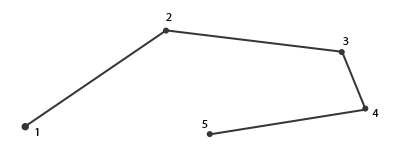
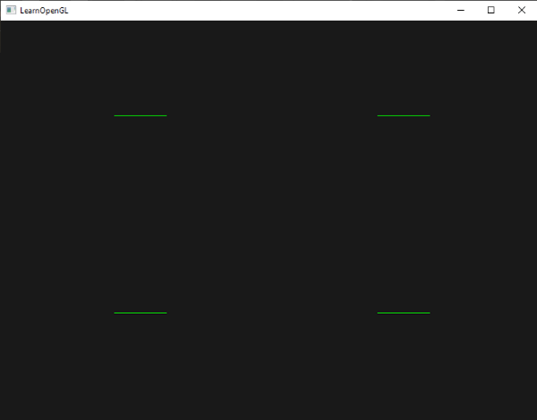
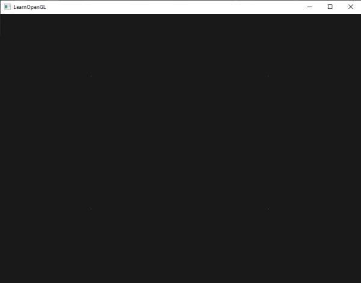
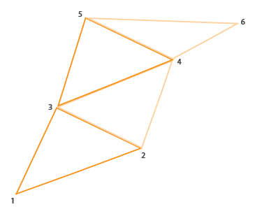
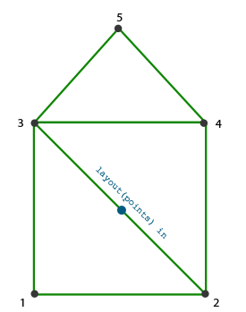
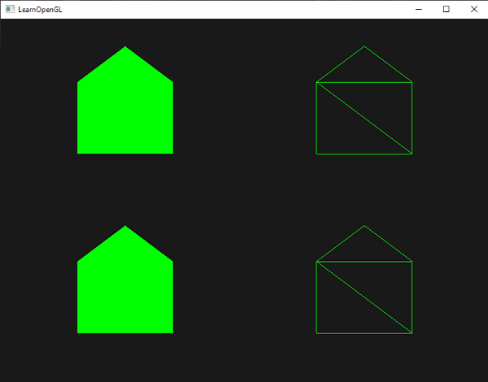
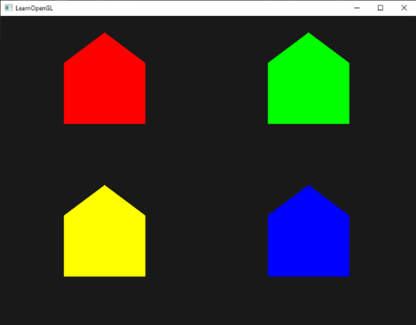
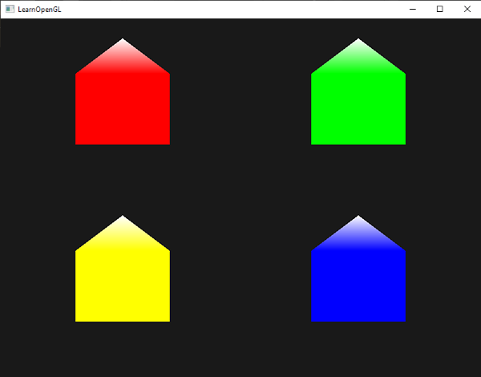
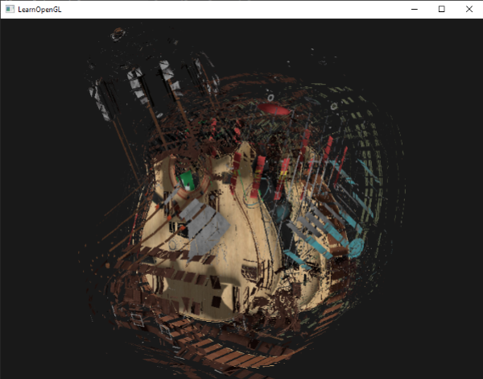
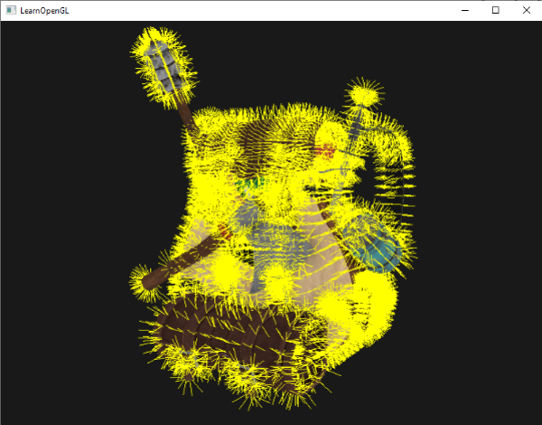

# 지오메트리 셰이더

정점 셰이더와 프래그먼트 셰이더 사이에는 선택적으로 **지오메트리 셰이더(geometry shader)**{:.g}라는 단계가 있습니다. 지오메트리 셰이더는 점이나 삼각형과 같은 단일 기본 도형을 구성하는 정점 집합을 입력으로 받습니다. 그런 다음 지오메트리 셰이더는 이러한 정점들을 다음 셰이더 단계로 보내기 전에 필요에 따라 변환할 수 있습니다. 지오메트리 셰이더의 흥미로운 점은 원래의 기본 도형(정점 집합)을 완전히 다른 기본 도형으로 변환할 수 있다는 것입니다. 이 과정에서 처음에 입력된 것보다 더 많은 정점을 생성할 수도 있습니다.

이제 바로 지오메트리 셰이더의 예시를 보여드리면서 본격적인 내용으로 들어가 보겠습니다.

```glsl
#version 330 core
layout (points) in;
layout (line_strip, max_vertices = 2) out;

void main() {    
    gl_Position = gl_in[0].gl_Position + vec4(-0.1, 0.0, 0.0, 0.0); 
    EmitVertex();

    gl_Position = gl_in[0].gl_Position + vec4( 0.1, 0.0, 0.0, 0.0);
    EmitVertex();
    
    EndPrimitive();
}
```

지오메트리 셰이더의 시작 부분에서는 정점 셰이더로부터 전달받는 입력 프리미티브의 유형을 선언해야 합니다. 이는 `in` 키워드 앞에 레이아웃 한정자(layout specifier)를 선언함으로써 수행됩니다. 이 입력 레이아웃 한정자는 다음과 같은 프리미티브 값들을 가질 수 있습니다.

 - `points`: `GL_POINTS` 프리미티브를 그릴 때 사용합니다. (정점 1개)
 - `lines`: `GL_LINES` 또는 `GL_LINE_STRIP`을 그릴 때 사용합니다. (정점 2개)
 - `lines_adjacency`: `GL_LINES_ADJACENCY` 또는 `GL_LINE_STRIP_ADJACENCY`를 그릴 때 사용합니다. (정점 4개)
 - `triangles`: `GL_TRIANGLES`, `GL_TRIANGLE_STRIP` 또는 `GL_TRIANGLE_FAN`을 그릴 때 사용합니다. (정점 3개)
 - `triangles_adjacency`: `GL_TRIANGLES_ADJACENCY` 또는 `GL_TRIANGLE_STRIP_ADJACENCY`를 그릴 때 사용합니다. (정점 6개)

이것들은 `glDrawArrays`와 같은 렌더링 호출에 제공할 수 있는 거의 모든 렌더링 기본 요소입니다. 정점을 `GL_TRIANGLES`로 그리도록 선택했다면 입력 한정자를 `triangles`로 설정해야 합니다. 괄호 안의 숫자는 단일 기본 요소가 포함할 수 있는 최소 정점 수를 나타냅니다.

또한 지오메트리 셰이더가 출력할 기본 데이터 유형을 지정해야 하며, 이는 `out` 키워드 앞에 레이아웃 지정자를 사용하여 수행합니다. 입력 레이아웃 한정자와 마찬가지로 출력 레이아웃 한정자도 여러 기본 데이터 유형 값을 가질 수 있습니다.

 - points
 - line_strip
 - triangle_strip

이 세 가지 출력 지정자만으로 입력 기본 도형에서 원하는 거의 모든 모양을 만들 수 있습니다. 예를 들어 삼각형 하나를 생성하려면 출력을 `triangle_strip`으로 지정하고 정점을 3개 출력하도록 하면 됩니다.

지오메트리 셰이더는 출력할 최대 정점 개수를 설정해야 합니다(이 개수를 초과하면 OpenGL은 추가 정점을 그리지 않습니다). 이 최대 정점 개수는 `out` 키워드의 레이아웃 한정자 내에서 설정할 수 있습니다. 이 예제에서는 최대 2개의 정점을 가진 `line_strip`을 출력할 것입니다.

!!! tip ""
    `line_strip`이 무엇인지 궁금하시다면, `line_strip`은 최소 2개의 점으로 이루어진 점들을 연결하여 하나의 연속적인 선을 만드는 도구입니다. 점이 추가될 때마다 새로운 점과 이전 점을 연결하는 새로운 선이 생성됩니다. 다음 이미지에서 5개의 점으로 이루어진 경우를 확인해 보세요.

    

의미 있는 결과를 얻으려면 이전 셰이더 단계의 출력을 가져오는 방법이 필요합니다. GLSL은 `gl_in`이라는 내장 변수를 제공하는데, 내부적으로는 (아마도) 다음과 같은 형태일 것입니다.

```glsl
in gl_Vertex
{
    vec4  gl_Position;
    float gl_PointSize;
    float gl_ClipDistance[];
} gl_in[];  
```

여기서는 (이전 장에서 이야기한 바와 같이) **인터페이스 블록**{:.g}으로 선언되었으며, 몇 가지 흥미로운 변수를 포함하고 있는데, 그중 가장 흥미로운 변수는 정점 셰이더의 출력으로 설정한 벡터를 담고 있는 `gl_Position`입니다.

대부분의 렌더링 기본 도형은 1개 이상의 정점을 포함하므로 배열로 선언되었다는 점에 유의하십시오. 지오메트리 셰이더는 기본 도형의 모든 정점을 입력으로 받습니다.

정점 셰이더 단계에서 얻은 정점 데이터를 사용하여 `EmitVertex`와 `EndPrimitive`라는 두 개의 지오메트리 셰이더 함수로 새로운 데이터를 생성할 수 있습니다. 지오메트리 셰이더는 지정된 출력 프리미티브 중 하나 이상을 생성/출력하도록 요구합니다. 이 경우 최소한 하나의 선 스트립 프리미티브를 생성해야 합니다.

```glsl
#version 330 core
layout (points) in;
layout (line_strip, max_vertices = 2) out;
  
void main() {    
    gl_Position = gl_in[0].gl_Position + vec4(-0.1, 0.0, 0.0, 0.0); 
    EmitVertex();

    gl_Position = gl_in[0].gl_Position + vec4( 0.1, 0.0, 0.0, 0.0);
    EmitVertex();
    
    EndPrimitive();
}    
```

`EmitVertex`를 호출할 때마다 `gl_Position`에 현재 설정된 벡터가 출력 프리미티브에 추가됩니다. `EndPrimitive`가 호출될 때마다 해당 프리미티브에 대해 방출된 모든 정점이 지정된 출력 렌더링 프리미티브로 결합됩니다. 하나 이상의 `EmitVertex` 호출 후 `EndPrimitive`를 반복적으로 호출함으로써 여러 개의 프리미티브를 생성할 수 있습니다. 이 특정 예제는 원래 정점 위치에서 약간 오프셋된 두 개의 정점을 방출한 다음 `EndPrimitive`를 호출하여 두 정점을 2개의 정점으로 이루어진 단일 라인 스트립으로 결합합니다.

이제 지오메트리 셰이더의 작동 방식을 (어느 정도) 이해했으니, 이 지오메트리 셰이더가 무엇을 하는지 짐작할 수 있을 겁니다. 이 지오메트리 셰이더는 점 프리미티브를 입력으로 받아 입력된 점을 중심으로 하는 수평선 프리미티브를 생성합니다. 이를 렌더링하면 다음과 같은 모습이 됩니다.



아직은 그다지 인상적이지 않지만, 이 결과물이 단 하나의 렌더링 호출만으로 생성되었다는 점은 흥미롭습니다.

```c++
glDrawArrays(GL_POINTS, 0, 4);  
```

이 예제는 비교적 간단하지만, 지오메트리 셰이더를 사용하여 새로운 도형을 실시간으로 (동적으로) 생성하는 방법을 보여줍니다. 이 장의 뒷부분에서는 지오메트리 셰이더를 사용하여 만들 수 있는 몇 가지 흥미로운 효과에 대해 논의하겠지만, 지금은 간단한 예제부터 시작하겠습니다.

## 지오메트리 셰이더 써보기

지오메트리 셰이더의 사용법을 보여주기 위해, 정규화된 장치 좌표계로 z축 평면에 4개의 점을 그리는 매우 간단한 장면을 렌더링해 보겠습니다. 점들의 좌표는 다음과 같습니다.

```c++
float points[] = {
	-0.5f,  0.5f, // top-left
	 0.5f,  0.5f, // top-right
	 0.5f, -0.5f, // bottom-right
	-0.5f, -0.5f  // bottom-left
};  
```

정점 셰이더는 z 평면에 점을 그려야 하므로 기본적인 정점 셰이더를 생성하겠습니다.

```glsl
#version 330 core
layout (location = 0) in vec2 aPos;

void main()
{
    gl_Position = vec4(aPos.x, aPos.y, 0.0, 1.0); 
}
```

그리고 우리는 프래그먼트 셰이더에서 직접 코딩한 모든 지점에 대해 녹색을 출력할 것입니다.

```glsl
#version 330 core
out vec4 FragColor;

void main()
{
    FragColor = vec4(0.0, 1.0, 0.0, 1.0);   
} 
```

점들의 정점 데이터에 대한 VAO와 VBO를 생성한 다음 glDrawArrays를 통해 그립니다.

```c++
shader.use();
glBindVertexArray(VAO);
glDrawArrays(GL_POINTS, 0, 4); 
```

그 결과 어두운 장면에 (잘 보이지 않는) 녹색 점 4개가 나타납니다.



하지만 우리 이미 이런 것들을 다 배우지 않았나요? 네, 맞습니다. 이제 지오메트리 셰이더 마법을 더해서 이 장면을 더욱 멋지게 만들어 보겠습니다.

학습 목적으로, 먼저 점 형태의 기본 도형을 입력으로 받아 다음 셰이더로 수정 없이 전달하는 **패스스루**{:.g} 지오메트리 셰이더를 만들어 보겠습니다.

```glsl
#version 330 core
layout (points) in;
layout (points, max_vertices = 1) out;

void main() {    
    gl_Position = gl_in[0].gl_Position; 
    EmitVertex();
    EndPrimitive();
}  
```

이제 이 지오메트리 셰이더는 상당히 이해하기 쉬울 것입니다. 입력으로 받은 수정되지 않은 정점 위치를 그대로 출력하고 점 프리미티브를 생성하는 것이 전부입니다.

정점 셰이더 및 프래그먼트 셰이더와 마찬가지로 지오메트리 셰이더도 컴파일하고 프로그램에 링크해야 하지만, 이번에는 셰이더 유형으로 `GL_GEOMETRY_SHADER`를 사용하여 셰이더를 생성합니다.

```c++
geometryShader = glCreateShader(GL_GEOMETRY_SHADER);
glShaderSource(geometryShader, 1, &gShaderCode, NULL);
glCompileShader(geometryShader);  
[...]
glAttachShader(program, geometryShader);
glLinkProgram(program); 
```

셰이더 컴파일 코드는 정점 셰이더 및 프래그먼트 셰이더와 동일합니다. 컴파일 또는 링크 오류가 있는지 꼭 확인하세요!

이제 컴파일하고 실행하면 다음과 같은 결과가 나타날 것입니다.


지오메트리 셰이더를 사용하지 않았을 때와 완전히 똑같습니다! 좀 밋밋하긴 하지만, 점들을 그릴 수 있었다는 건 지오메트리 셰이더가 제대로 작동한다는 뜻이니까요. 이제 좀 더 멋진 기능들을 추가해 볼까요!

## 집을 지어보자

점과 선을 그리는 것은 그다지 흥미롭지 않으므로, 지오메트리 셰이더를 사용하여 각 점의 위치에 집을 그리는 좀 더 창의적인 방법을 사용해 보겠습니다. 지오메트리 셰이더의 출력을 **triangle_strip**{:.g}으로 설정하고 총 세 개의 삼각형(정사각형 집의 두 개와 지붕 하나)을 그리면 됩니다.

OpenGL에서 삼각형 스트립(triangle strip)은 더 적은 수의 정점으로 삼각형을 효율적으로 그리는 방법입니다. 첫 번째 삼각형이 그려진 후, 각 정점은 첫 번째 삼각형 옆에 새로운 삼각형을 생성합니다. 즉, 인접한 세 정점이 삼각형을 형성합니다. 삼각형 스트립을 형성하는 정점이 총 6개라면 (1,2,3), (2,3,4), (3,4,5), (4,5,6)과 같은 삼각형이 생성되어 총 4개의 삼각형이 만들어집니다. 삼각형 스트립은 최소 3개의 정점이 필요하며 N-2개의 삼각형을 생성합니다. 6개의 정점을 사용하면 6-2 = 4개의 삼각형이 생성됩니다. 다음 이미지는 이를 보여줍니다.



지오메트리 셰이더의 출력으로 삼각형 스트립을 사용하면, 인접한 세 개의 삼각형을 올바른 순서로 생성하여 원하는 집 모양을 쉽게 만들 수 있습니다. 다음 이미지는 필요한 삼각형을 얻기 위해 어떤 순서로 어떤 정점을 그려야 하는지를 보여줍니다. 파란색 점은 입력 지점입니다.



이는 다음과 같은 지오메트리 셰이더로 변환됩니다.

```glsl
#version 330 core
layout (points) in;
layout (triangle_strip, max_vertices = 5) out;

void build_house(vec4 position)
{    
    gl_Position = position + vec4(-0.2, -0.2, 0.0, 0.0);    // 1:bottom-left
    EmitVertex();   
    gl_Position = position + vec4( 0.2, -0.2, 0.0, 0.0);    // 2:bottom-right
    EmitVertex();
    gl_Position = position + vec4(-0.2,  0.2, 0.0, 0.0);    // 3:top-left
    EmitVertex();
    gl_Position = position + vec4( 0.2,  0.2, 0.0, 0.0);    // 4:top-right
    EmitVertex();
    gl_Position = position + vec4( 0.0,  0.4, 0.0, 0.0);    // 5:top
    EmitVertex();
    EndPrimitive();
}

void main() {    
    build_house(gl_in[0].gl_Position);
}  
```

이 지오메트리 셰이더는 5개의 정점을 생성하는데, 각 정점은 점의 위치에 오프셋을 더한 값으로, 하나의 큰 삼각형 띠를 형성합니다. 이렇게 생성된 기본 도형은 래스터화되고, 프래그먼트 셰이더가 전체 삼각형 띠에 대해 실행되어 렌더링된 각 점마다 집을 생성합니다.



각 집이 실제로 3개의 삼각형으로 구성되어 있음을 알 수 있습니다. 이 삼각형들은 모두 공간상의 한 점을 사용하여 그려졌습니다. 하지만 초록색 집들은 다소 밋밋해 보이므로, 각 집에 고유한 색상을 부여하여 좀 더 생동감 있게 만들어 보겠습니다. 이를 위해 정점 셰이더에 정점별 색상 정보를 담은 추가 속성을 추가하고, 이 속성을 지오메트리 셰이더로 전달한 다음, 지오메트리 셰이더를 통해 프래그먼트 셰이더로 전달하겠습니다.

업데이트된 정점 데이터는 다음과 같습니다.

```c++
float points[] = {
    -0.5f,  0.5f, 1.0f, 0.0f, 0.0f, // top-left
     0.5f,  0.5f, 0.0f, 1.0f, 0.0f, // top-right
     0.5f, -0.5f, 0.0f, 0.0f, 1.0f, // bottom-right
    -0.5f, -0.5f, 1.0f, 1.0f, 0.0f  // bottom-left
};  
```

다음으로 인터페이스 블록을 사용하여 색상 속성을 지오메트리 셰이더로 전달하도록 정점 셰이더를 업데이트합니다.

```glsl
#version 330 core
layout (location = 0) in vec2 aPos;
layout (location = 1) in vec3 aColor;

out VS_OUT {
    vec3 color;
} vs_out;

void main()
{
    gl_Position = vec4(aPos.x, aPos.y, 0.0, 1.0); 
    vs_out.color = aColor;
}  
```

그런 다음 지오메트리 셰이더에서도 동일한 인터페이스 블록(인터페이스 이름은 다르게)을 선언해야 합니다.

```glsl
in VS_OUT {
    vec3 color;
} gs_in[];  
```

지오메트리 셰이더는 입력으로 정점 집합을 사용하기 때문에, 현재 단일 정점만 있더라도 정점 셰이더에서 지오메트리 셰이더로 전달되는 입력 데이터는 항상 정점 데이터 배열로 표현됩니다.

!!! tip ""
    지오메트리 셰이더로 데이터를 전송하기 위해 반드시 인터페이스 블록을 사용할 필요는 없습니다. 다음과 같이 작성할 수도 있습니다.
    
    ```glsl
    in vec3 outColor[];
    ```

    정점 셰이더가 색상 벡터를 `out vec3 outColor`로 출력하는 경우에 이 방법이 효과적입니다. 하지만 인터페이스 블록은 지오메트리 셰이더와 같은 다른 셰이더에서 사용하기가 더 쉽습니다. 실제로 지오메트리 셰이더의 입력은 상당히 커질 수 있으므로, 이를 하나의 큰 인터페이스 블록 배열로 묶는 것이 훨씬 효율적입니다.

다음 프래그먼트 셰이더 단계에 사용할 출력 색상 벡터도 선언해야 합니다.

```glsl
out vec3 fColor;  
```

프래그먼트 셰이더는 단일 (보간된) 색상만 기대하기 때문에 여러 색상을 전달하는 것은 의미가 없습니다. 따라서 fColor 벡터는 배열이 아니라 단일 벡터입니다. 정점을 출력할 때, 해당 정점은 fColor에 저장된 마지막 값을 출력 값으로 사용합니다. 집의 경우, 첫 번째 정점이 출력되기 전에 정점 셰이더의 색상으로 fColor를 한 번만 채워 집 전체를 색칠할 수 있습니다.

```glsl
fColor = gs_in[0].color; // 입력 정점이 하나뿐이므로 gs_in[0]
gl_Position = position + vec4(-0.2, -0.2, 0.0, 0.0);    // 1:bottom-left   
EmitVertex();   
gl_Position = position + vec4( 0.2, -0.2, 0.0, 0.0);    // 2:bottom-right
EmitVertex();
gl_Position = position + vec4(-0.2,  0.2, 0.0, 0.0);    // 3:top-left
EmitVertex();
gl_Position = position + vec4( 0.2,  0.2, 0.0, 0.0);    // 4:top-right
EmitVertex();
gl_Position = position + vec4( 0.0,  0.4, 0.0, 0.0);    // 5:top
EmitVertex();
EndPrimitive();  
```

생성된 모든 정점에는 fColor에 저장된 마지막 값이 데이터에 포함되며, 이는 입력 정점의 속성에 정의된 색상과 같습니다. 이제 모든 집은 고유한 색상을 갖게 됩니다.



재미 삼아 겨울인 척하며 마지막 정점에 다른 색을 입혀 지붕에 눈이 조금 내린 것처럼 꾸며볼 수도 있겠네요.

```glsl
fColor = gs_in[0].color; 
gl_Position = position + vec4(-0.2, -0.2, 0.0, 0.0);    // 1:bottom-left   
EmitVertex();   
gl_Position = position + vec4( 0.2, -0.2, 0.0, 0.0);    // 2:bottom-right
EmitVertex();
gl_Position = position + vec4(-0.2,  0.2, 0.0, 0.0);    // 3:top-left
EmitVertex();
gl_Position = position + vec4( 0.2,  0.2, 0.0, 0.0);    // 4:top-right
EmitVertex();
gl_Position = position + vec4( 0.0,  0.4, 0.0, 0.0);    // 5:top
fColor = vec3(1.0, 1.0, 1.0);
EmitVertex();
EndPrimitive();  
```

그 결과는 이제 다음과 같습니다.



[여기](https://github.com/JoeyDeVries/LearnOpenGL/blob/master/src/4.advanced_opengl/9.1.geometry_shader_houses/geometry_shader_houses.cpp)에서 소스 코드와 OpenGL 코드를 비교할 수 있습니다.

지오메트리 셰이더를 사용하면 가장 단순한 기본 도형으로도 상당히 창의적인 표현이 가능하다는 것을 알 수 있습니다. GPU의 초고속 하드웨어에서 도형이 동적으로 생성되기 때문에 정점 버퍼에서 직접 도형을 정의하는 것보다 훨씬 강력한 성능을 발휘합니다. 지오메트리 셰이더는 복셀 세계의 정육면체나 넓은 야외 들판의 풀잎처럼 단순하고 (종종 반복되는) 도형을 표현하는 데 매우 유용한 도구입니다.

## 물체 폭팔

집을 그리는 것도 재밌긴 하지만, 그렇게 자주 쓰일 것 같지는 않아요. 그래서 한 단계 더 나아가서 물체를 폭발시키는 방법을 배워볼 거예요! 이것도 자주 쓰일 것 같지는 않지만, 확실히 재밌을 거예요!

물체를 '폭발시킨다'라고 할 때, 실제로 소중한 정점 묶음을 날려버리는 것이 아니라, 각 삼각형을 법선 벡터 방향으로 짧은 시간 동안 이동시키는 것입니다. 그 결과 물체를 구성하는 삼각형 전체가 폭발하는 것처럼 보입니다. 배낭 모델에서 삼각형이 폭발하는 효과는 대략 다음과 같습니다.



이러한 지오메트리 셰이더 효과의 가장 큰 장점은 객체의 복잡성과 관계없이 모든 객체에 적용된다는 점입니다.

각 정점을 삼각형의 법선 벡터 방향으로 이동시키려면 먼저 이 법선 벡터를 계산해야 합니다. 즉, 우리가 접근할 수 있는 3개의 정점만을 사용하여 삼각형의 표면에 수직인 벡터를 계산해야 합니다. 변형 챕터에서 배웠듯이, 두 벡터에 수직인 벡터는 외적을 통해 얻을 수 있습니다. 삼각형의 표면에 평행한 두 벡터 a와 b가 있다면, 이 두 벡터의 외적을 통해 삼각형의 법선 벡터를 얻을 수 있습니다. 다음 지오메트리 셰이더 함수는 3개의 입력 정점 좌표를 사용하여 법선 벡터를 계산합니다.

```glsl
vec3 GetNormal()
{
   vec3 a = vec3(gl_in[0].gl_Position) - vec3(gl_in[1].gl_Position);
   vec3 b = vec3(gl_in[2].gl_Position) - vec3(gl_in[1].gl_Position);
   return normalize(cross(a, b));
}  
```

여기서는 벡터 뺄셈을 이용하여 삼각형의 표면에 평행한 두 벡터 a와 b를 구합니다. 두 벡터를 서로 빼면 두 벡터의 차 벡터가 됩니다. 세 점 모두 삼각형 평면 위에 있으므로, 삼각형 평면 위의 어떤 벡터라도 서로 빼면 평면에 평행한 벡터가 됩니다. 단, 교차 함수에서 a와 b의 순서를 바꾸면 반대 방향을 가리키는 법선 벡터가 나오므로 순서가 중요합니다!

이제 법선 벡터를 계산하는 방법을 알았으니, 이 법선 벡터와 정점 위치 벡터를 입력으로 받는 explode 함수를 만들 수 있습니다. 이 함수는 위치 벡터를 법선 벡터의 방향으로 이동시킨 새로운 벡터를 반환합니다.

```glsl
vec4 explode(vec4 position, vec3 normal)
{
    float magnitude = 2.0;
    vec3 direction = normal * ((sin(time) + 1.0) / 2.0) * magnitude; 
    return position + vec4(direction, 0.0);
} 
```

함수 자체는 그다지 복잡하지 않습니다. sin 함수는 시간에 따라 변하는 변수를 인수로 받으며, 이 변수는 시간에 따라 -1.0에서 1.0 사이의 값을 반환합니다. 객체가 붕괴되는 것을 방지하기 위해 sin 값을 [0,1] 범위로 변환합니다. 이렇게 얻은 값을 사용하여 법선 벡터를 스케일링하고, 그 결과로 얻은 방향 벡터를 위치 벡터에 더합니다.

저희 모델 로더를 사용하여 불러온 모델을 그릴 때 **폭발 효과**{:.g}를 위한 전체 지오메트리 셰이더는 대략 다음과 같습니다.

```glsl
#version 330 core
layout (triangles) in;
layout (triangle_strip, max_vertices = 3) out;

in VS_OUT {
    vec2 texCoords;
} gs_in[];

out vec2 TexCoords; 

uniform float time;

vec4 explode(vec4 position, vec3 normal) { ... }

vec3 GetNormal() { ... }

void main() {    
    vec3 normal = GetNormal();

    gl_Position = explode(gl_in[0].gl_Position, normal);
    TexCoords = gs_in[0].texCoords;
    EmitVertex();
    gl_Position = explode(gl_in[1].gl_Position, normal);
    TexCoords = gs_in[1].texCoords;
    EmitVertex();
    gl_Position = explode(gl_in[2].gl_Position, normal);
    TexCoords = gs_in[2].texCoords;
    EmitVertex();
    EndPrimitive();
} 
```

정점을 출력하기 전에 적절한 텍스처 좌표도 함께 출력하고 있다는 점에 유의하십시오.

또한 OpenGL 코드에서 시간 유니폼 변수를 실제로 설정하는 것을 잊지 마세요.

```c++
shader.setFloat("time", glfwGetTime());  
```

결과적으로 3D 모델은 시간이 지남에 따라 정점이 계속해서 폭발하는 것처럼 보이다가 다시 정상으로 돌아옵니다. 그다지 유용하지는 않지만, 지오메트리 셰이더의 고급 사용법을 보여줍니다. [여기](https://github.com/JoeyDeVries/LearnOpenGL/blob/master/src/4.advanced_opengl/9.2.geometry_shader_exploding/geometry_shader_exploding.cpp)에서 여러분의 소스 코드를 전체 소스 코드와 비교해 볼 수 있습니다.

## 법선 벡터 시각화

분위기를 바꿔서 이번에는 지오메트리 셰이더를 실제로 유용하게 사용하는 예제를 살펴보겠습니다. 바로 객체의 법선 벡터를 시각화하는 것입니다. 조명 셰이더를 프로그래밍하다 보면 원인을 파악하기 어려운 이상한 시각적 출력 결과를 접하게 됩니다. 조명 오류의 흔한 원인 중 하나는 잘못된 법선 벡터입니다. 이는 정점 데이터를 잘못 로드했거나, 정점 속성으로 잘못 지정했거나, 셰이더에서 법선 벡터를 잘못 관리했기 때문에 발생할 수 있습니다. 우리가 원하는 것은 제공된 법선 벡터가 올바른지 확인하는 방법입니다. 법선 벡터가 올바른지 확인하는 좋은 방법은 시각화하는 것이며, 마침 지오메트리 셰이더가 이 목적에 매우 유용한 도구입니다.

아이디어는 다음과 같습니다. 먼저 지오메트리 셰이더 없이 장면을 일반적인 방식으로 그린 ​​다음, 지오메트리 셰이더를 통해 생성된 법선 벡터만 표시하면서 장면을 다시 그립니다. 지오메트리 셰이더는 삼각형 프리미티브를 입력으로 받아 각 정점의 법선 방향으로 3개의 선(각 정점에 대한 법선 벡터 하나씩)을 생성합니다. 코드로 표현하면 다음과 같습니다.

```c++
shader.use();
DrawScene();
normalDisplayShader.use();
DrawScene();
```

이번에는 정점 법선을 직접 생성하는 대신 모델에서 제공하는 정점 법선을 사용하는 지오메트리 셰이더를 만들어 보겠습니다. 뷰와 모델 행렬로 인한 크기 조정 및 회전을 고려하기 위해 법선 행렬을 사용하여 법선을 변환합니다. 지오메트리 셰이더는 위치 벡터를 뷰 공간 좌표로 받으므로 법선 벡터도 같은 공간으로 변환해야 합니다. 이 모든 작업은 정점 셰이더에서 수행할 수 있습니다.

```glsl
#version 330 core
layout (location = 0) in vec3 aPos;
layout (location = 1) in vec3 aNormal;

out VS_OUT {
    vec3 normal;
} vs_out;

uniform mat4 view;
uniform mat4 model;

void main()
{
    gl_Position = view * model * vec4(aPos, 1.0); 
    mat3 normalMatrix = mat3(transpose(inverse(view * model)));
    vs_out.normal = normalize(vec3(vec4(normalMatrix * aNormal, 0.0)));
}
```

변환된 뷰 공간 법선 벡터는 인터페이스 블록을 통해 다음 셰이더 단계로 전달됩니다. 기하 셰이더는 각 정점(위치 벡터와 법선 벡터 포함)을 가져와 각 위치 벡터에서 법선 벡터를 그립니다.

```glsl
#version 330 core
layout (triangles) in;
layout (line_strip, max_vertices = 6) out;

in VS_OUT {
    vec3 normal;
} gs_in[];

const float MAGNITUDE = 0.4;
  
uniform mat4 projection;

void GenerateLine(int index)
{
    gl_Position = projection * gl_in[index].gl_Position;
    EmitVertex();
    gl_Position = projection * (gl_in[index].gl_Position + 
                                vec4(gs_in[index].normal, 0.0) * MAGNITUDE);
    EmitVertex();
    EndPrimitive();
}

void main()
{
    GenerateLine(0); // 첫번째 법선 정점
    GenerateLine(1); // 두번째 법선 정점
    GenerateLine(2); // 세번째 법선 정점
}  
```

이러한 지오메트리 셰이더의 내용은 이제 충분히 이해될 것입니다. 표시되는 법선 벡터의 크기를 제한하기 위해 법선 벡터에 크기 벡터를 곱하고 있다는 점에 유의하세요 (그렇지 않으면 벡터가 너무 커질 수 있습니다).

법선 시각화는 주로 디버깅 목적으로 사용되므로 프래그먼트 셰이더를 이용하여 단색 선(또는 원한다면 아주 화려한 선)으로 표시할 수 있습니다.

```glsl
#version 330 core
out vec4 FragColor;

void main()
{
    FragColor = vec4(1.0, 1.0, 0.0, 1.0);
}  
```

먼저 일반 셰이더로 모델을 렌더링한 다음, 특수 노멀 시각화 셰이더로 렌더링하면 다음과 같은 결과가 나타납니다.

!!

배낭이 털북숭이처럼 보인다는 점은 차치하고라도, 이 방법은 모델의 법선 벡터가 실제로 정확한지 판단하는 데 매우 유용한 방법을 제공합니다. 이와 같은 지오메트리 셰이더는 사물에 **털(fur)**{:.g}을 추가하는 데에도 사용될 수 있을 것입니다.

OpenGL의 소스 코드는 [여기](https://github.com/JoeyDeVries/LearnOpenGL/blob/master/src/4.advanced_opengl/9.3.geometry_shader_normals/normal_visualization.cpp)에서 찾을 수 있습니다.

