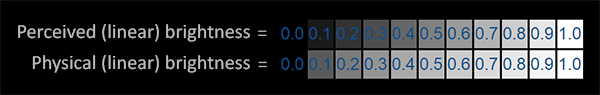
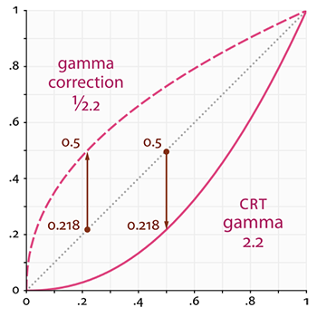
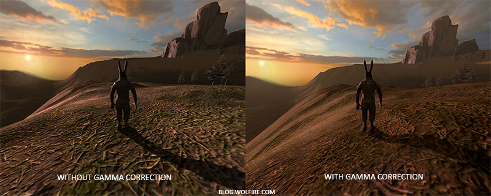
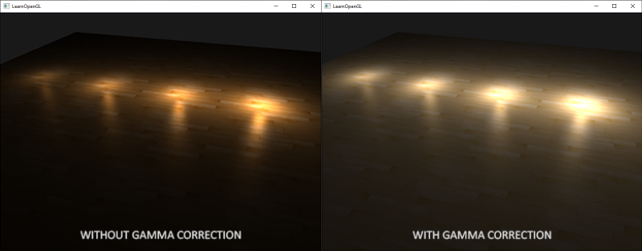
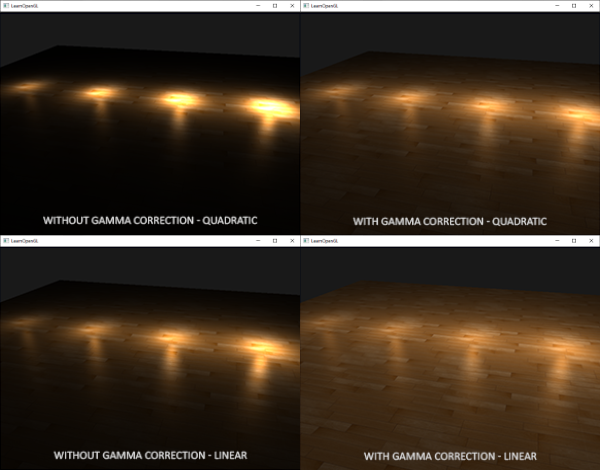

# 감마 보정

장면의 최종 픽셀 색상을 계산하는 즉시 모니터에 표시해야 합니다. 디지털 이미징 초창기에는 대부분 CRT(음극선관) 모니터였습니다. 이 모니터는 입력 전압이 두 배가 되어도 밝기가 두 배가 되지 않는 물리적 특성을 가지고 있었습니다. 입력 전압이 두 배가 되면 밝기는 대략 2.2의 지수 함수 관계를 가지게 되는데, 이를 모니터의 **감마**{:.g}라고 합니다. 이는 (우연히도) 인간이 밝기를 측정하는 방식과도 매우 유사한데, 밝기 또한 비슷한 (반비례) 제곱 관계를 가지기 때문입니다. 이 모든 것이 무엇을 의미하는지 더 잘 이해하려면 다음 이미지를 참조하세요.



윗줄은 사람의 눈에 맞는 밝기 스케일처럼 보입니다. 밝기를 두 배로 늘리면(예: 0.1에서 0.2로) 실제로 두 배로 밝아진 것처럼 보이고, 변화도 일관성 있게 나타납니다. 하지만 빛의 물리적 밝기, 즉 광원에서 나오는 광자의 양을 기준으로 보면 아랫줄이 실제로 정확한 밝기를 나타냅니다. 아랫줄에서는 밝기를 두 배로 늘리면 물리적 밝기가 같아지지만, 우리 눈은 밝기를 다르게 인식하기 때문에(특히 어두운 색의 변화에 ​​더 민감하기 때문에) 어색하게 느껴지는 것입니다.

인간의 눈은 밝기 단계를 기준으로 색상을 인식하는 것을 선호하기 때문에 모니터는 (오늘날까지도) 출력 색상을 표시할 때 거듭제곱 관계를 사용하여 원래의 물리적 밝기 색상을 밝기 단계의 비선형 밝기 색상에 매핑합니다.

모니터의 이러한 비선형 매핑은 우리 눈에 더 보기 좋은 밝기 결과를 제공하지만, 그래픽 렌더링 측면에서는 한 가지 문제가 있습니다. 우리가 애플리케이션에서 설정하는 모든 색상 및 밝기 옵션은 모니터에서 인지하는 것을 기반으로 하므로 실제로는 모두 비선형 밝기/색상 옵션입니다. 아래 그래프를 참조하세요.



점선은 선형 공간에서의 색상/밝기 값을 나타내고, 실선은 모니터가 표시하는 색 공간을 나타냅니다. 선형 공간에서 색상을 두 배로 늘리면 결과적으로 값도 두 배가 됩니다. 예를 들어, 어두운 빨간색 빛을 나타내는 색 벡터 (0.5, 0.0, 0.0)을 생각해 보겠습니다. 이 빛을 선형 공간에서 두 배로 늘리면 그래프에서 볼 수 있듯이 (1.0, 0.0, 0.0)이 됩니다. 하지만 모니터에서는 원래 색상이 그래프에서 볼 수 있듯이 (0.218, 0.0, 0.0)으로 표시됩니다. 여기서 문제가 발생합니다. 어두운 빨간색 빛을 선형 공간에서 두 배로 늘리면 모니터에서는 실제로 4.5배 이상 밝아지는 것입니다!

지금까지 우리는 선형 공간에서 작업한다고 가정했지만, 실제로는 모니터의 출력 공간에서 작업했기 때문에 우리가 설정한 모든 색상과 조명 변수는 물리적으로 정확한 것이 아니라 단지 모니터에서 (어느 정도) 올바르게 보이는 것일 뿐이었습니다. 이러한 이유로 우리(그리고 예술가들)는 일반적으로 모니터가 어둡게 처리하는 값보다 훨씬 밝게 조명 값을 설정하는데, 결과적으로 대부분의 선형 공간 계산이 부정확해집니다. 모니터(CRT)와 선형 그래프는 모두 시작점과 끝점이 같다는 점에 유의하십시오. 디스플레이에 의해 어둡게 처리되는 것은 중간 값입니다.

색상은 디스플레이 출력에 따라 설정되므로 선형 공간에서의 모든 중간(조명) 계산은 물리적으로 부정확합니다. 아래 이미지에서 볼 수 있듯이, 고급 조명 알고리즘이 적용될수록 이러한 현상이 더욱 두드러집니다.



감마 보정을 적용하면 (업데이트된) 색상 값들이 더욱 자연스럽게 어우러지고 어두운 영역의 디테일이 더욱 살아나는 것을 확인할 수 있습니다. 전반적으로 몇 가지 작은 수정만으로 이미지 품질이 향상되었습니다.

모니터 감마를 제대로 보정하지 않으면 조명이 부자연스럽게 보이고, 아티스트들은 사실적이고 보기 좋은 결과물을 얻기 어려워집니다. 해결책은 **감마 보정**{:.g}을 적용하는 것입니다.

## 감마 보정

감마 보정의 핵심은 모니터에 표시하기 전에 최종 출력 색상에 모니터 감마의 역수를 적용하는 것입니다. 이 장 앞부분의 감마 곡선 그래프를 다시 살펴보면 모니터 감마 곡선의 역수를 나타내는 점선이 있습니다. 각 선형 출력 색상에 이 역 감마 곡선을 곱하여 색상을 밝게 만듭니다. 그런 다음 색상이 모니터에 표시되는 순간 모니터의 감마 곡선이 적용되어 최종 색상이 선형으로 변환됩니다. 즉, 중간 색상을 밝게 하여 모니터에서 어둡게 할 때 전체적인 색상 균형을 맞추는 것입니다.

다른 예를 들어 보겠습니다. 다시 진한 빨간색$(0.5, 0.0, 0.0)$이 있다고 가정해 봅시다. 이 색상을 모니터에 표시하기 전에 먼저 감마 보정 곡선을 색상 값에 적용합니다. 모니터에서 선형적으로 표시되는 색상은 대략 $2.2$의 거듭제곱으로 스케일링되므로, 그 역으로 색상을 $1/2.2$의 거듭제곱으로 스케일링해야 합니다. 따라서 감마 보정된 진한 빨간색은 $(0.5, 0.0, 0.0)^{1/2.2} = (0.5, 0.0, 0.0)^{0.45} = (0.73, 0.0, 0.0)$이 됩니다. 이렇게 보정된 색상을 모니터에 입력하면 결과적으로 $(0.73, 0.0, 0.0)^{2.2} = (0.5, 0.0, 0.0)$으로 표시됩니다. 감마 보정을 사용하면 모니터가 애플리케이션에서 선형적으로 설정한 색상 그대로 표시하는 것을 확인할 수 있습니다.

!!! tip ""
    감마 값 2.2는 대부분의 디스플레이에서 평균적인 감마 값을 대략적으로 나타내는 기본 감마 값입니다. 이 감마 값 2.2로 표현되는 색 공간을 **sRGB**{:.g} 색 공간이라고 합니다(100% 정확하지는 않지만 상당히 근접합니다). 각 모니터는 고유한 감마 곡선을 가지고 있지만, 감마 값 2.2는 대부분의 모니터에서 좋은 결과를 제공합니다. 이러한 이유로 게임에서는 모니터에 따라 약간씩 달라지는 감마 설정을 플레이어가 변경할 수 있도록 하는 경우가 많습니다.

장면에 감마 보정을 적용하는 방법에는 두 가지가 있습니다.

 - OpenGL의 내장 sRGB 프레임버퍼 지원 기능을 사용하는 방법.
 - 프래그먼트 셰이더에서 직접 감마 보정을 처리하는 방법.

첫 번째 옵션은 아마 가장 쉬운 방법이겠지만, 그만큼 제어권은 적습니다. `GL_FRAMEBUFFER_SRGB`를 활성화하면, 이후의 모든 그리기 명령에서 OpenGL이 색상을 컬러 버퍼에 저장하기 전에 (sRGB 색 공간에서) 감마 보정을 먼저 수행하도록 설정하게 됩니다. sRGB는 대략 2.2의 감마 값에 해당하는 색 공간이며, 대부분의 장치에서 표준으로 사용됩니다. `GL_FRAMEBUFFER_SRGB`를 활성화한 후에는, OpenGL이 모든 프래그먼트 셰이더 실행 직후 기본 프레임버퍼를 포함한 모든 후속 프레임버퍼에 대해 자동으로 감마 보정을 수행합니다.

GL_FRAMEBUFFER_SRGB 활성화는 단순히 glEnable 함수를 호출하기만 하면 됩니다.

```c++
glEnable(GL_FRAMEBUFFER_SRGB); 
```

이제부터 렌더링된 이미지는 감마 보정을 거치게 되며, 이 작업은 하드웨어에서 수행되므로 추가 비용이 발생하지 않습니다. 이 방식(및 다른 방식)에서 유의해야 할 점은 감마 보정이 색상을 선형 공간에서 비선형 공간으로 변환한다는 것입니다. 따라서 감마 보정은 최종 단계에서만 수행해야 합니다. 최종 출력 전에 감마 보정을 적용하면 해당 색상에 대한 모든 후속 작업이 잘못된 값으로 수행될 수 있습니다. 예를 들어, 여러 프레임 버퍼를 사용하는 경우 프레임 버퍼 간에 전달되는 중간 결과는 선형 공간으로 유지하고 마지막 프레임 버퍼에서만 감마 보정을 적용한 후 모니터로 전송하는 것이 좋습니다.

두 번째 접근 방식은 약간 더 많은 작업이 필요하지만 감마 연산에 대한 완벽한 제어권을 제공합니다. 각 관련 프래그먼트 셰이더 실행이 끝날 때 감마 보정을 적용하여 최종 색상이 모니터로 출력되기 전에 감마 보정이 완료되도록 합니다.

```glsl
void main()
{
    // 선형 공간에서 매우 화려한 조명 효과를 구현합니다
    [...]
    // 감마 보정 적용
    float gamma = 2.2;
    FragColor.rgb = pow(fragColor.rgb, vec3(1.0/gamma));
}
```

마지막 코드 줄은 `fragColor`의 각 색상 구성 요소를 `1.0/gamma`로 높여 이 프래그먼트 셰이더 실행의 출력 색상을 수정합니다.

이 접근 방식의 문제점은 일관성을 유지하기 위해 최종 출력에 영향을 미치는 각 프래그먼트 셰이더에 감마 보정을 적용해야 한다는 것입니다. 여러 객체에 대해 수십 개의 프래그먼트 셰이더가 있는 경우, 각 셰이더에 감마 보정 코드를 추가해야 합니다. 더 쉬운 해결책은 렌더링 루프에 후처리 단계를 도입하고, 후처리된 쿼드에 최종 단계에서 감마 보정을 적용하는 것입니다. 이렇게 하면 한 번만 수행하면 됩니다.

저 한 줄은 감마 보정의 기술적 구현을 ​​나타냅니다. 그다지 인상적이지는 않지만, 감마 보정을 할 때는 고려해야 할 몇 가지 추가 사항이 있습니다.

## sRGB 텍스처

모니터는 감마를 적용하여 색상을 표시하기 때문에 컴퓨터에서 그림을 그리거나 편집하거나 색칠할 때 모니터에 보이는 색상을 기준으로 색상을 선택하게 됩니다. 즉, 생성하거나 편집하는 모든 이미지는 선형 색 공간이 아닌 sRGB 색 공간에 있게 됩니다. 예를 들어 화면에서 인지되는 밝기를 기준으로 어두운 빨간색을 두 배로 늘리는 것은 빨간색 구성 요소의 양을 두 배로 늘리는 것과는 다릅니다.

결과적으로, 텍스처 아티스트들이 눈으로 이미지를 만들 때 모든 텍스처 값은 sRGB 공간에 있기 때문에, 렌더링 애플리케이션에서 이러한 텍스처를 그대로 사용하려면 이를 고려해야 합니다. 감마 보정에 대해 알기 전에는 텍스처가 우리가 작업하는 공간과 동일한 sRGB 공간에서 제대로 표시되었기 때문에 큰 문제가 되지 않았습니다. 텍스처는 있는 그대로 표시되었고, 이는 문제가 되지 않았습니다. 그러나 이제 모든 것을 선형 공간으로 표시하기 때문에 다음 이미지에서 볼 수 있듯이 텍스처 색상이 왜곡됩니다.



텍스처 이미지가 너무 밝은 이유는 감마 보정을 두 번 거쳤기 때문입니다! 생각해 보세요. 모니터에 보이는 이미지를 기반으로 이미지를 생성할 때, 모니터에서 보기 좋게 보이도록 이미지의 색상 값을 감마 보정합니다. 그런데 렌더링 과정에서 다시 한 번 감마 보정을 하기 때문에 최종 이미지가 지나치게 밝아지는 것입니다.

이 문제를 해결하려면 텍스처 아티스트가 선형 공간에서 작업하도록 해야 합니다. 하지만 sRGB 공간에서 작업하는 것이 더 쉽고 대부분의 도구가 선형 텍스처링을 제대로 지원하지 않기 때문에 이는 바람직한 해결책은 아닐 것입니다.

다른 해결책은 색상 값에 대한 계산을 수행하기 전에 이러한 sRGB 텍스처를 선형 공간으로 다시 보정하거나 변환하는 것입니다. 다음과 같이 수행할 수 있습니다.

```glsl
float gamma = 2.2;
vec3 diffuseColor = pow(texture(diffuse, texCoords).rgb, vec3(gamma));
```

하지만 sRGB 공간의 각 텍스처에 대해 이 작업을 수행하는 것은 상당히 번거롭습니다. 다행히 OpenGL은 `GL_SRGB` 및 `GL_SRGB_ALPHA`라는 내부 텍스처 형식을 제공하여 이러한 문제를 해결할 수 있는 또 다른 방법을 제시합니다.

OpenGL에서 이 두 가지 sRGB 텍스처 형식 중 하나를 사용하여 텍스처를 생성하면 OpenGL은 해당 텍스처를 사용하는 즉시 자동으로 색상을 선형 공간으로 보정하여 선형 공간에서 제대로 작업할 수 있도록 합니다. 다음과 같이 텍스처를 sRGB 텍스처로 지정할 수 있습니다.

```c++
glTexImage2D(GL_TEXTURE_2D, 0, GL_SRGB, width, height, 0, GL_RGB, GL_UNSIGNED_BYTE, data);  
```

텍스처에 알파 성분을 포함시키려면 텍스처의 내부 형식을 `GL_SRGB_ALPHA`로 지정해야 합니다.

sRGB 공간에서 텍스처를 지정할 때는 주의해야 합니다. 모든 텍스처가 실제로 sRGB 공간에 있는 것은 아니기 때문입니다. 객체의 색상을 지정하는 데 사용되는 텍스처(예: 디퓨즈 텍스처)는 거의 항상 sRGB 공간입니다. 반면, 조명 매개변수를 가져오는 데 사용되는 텍스처(예: 스페큘러 맵 및 노멀 맵)는 거의 항상 선형 공간입니다. 따라서 이러한 텍스처를 sRGB로 설정하면 조명이 이상하게 보일 수 있습니다. 어떤 텍스처를 sRGB로 지정할지 신중하게 고려해야 합니다.

디퓨즈 텍스처를 sRGB 텍스처로 지정하면 예상했던 시각적 출력을 다시 얻을 수 있지만, 이번에는 모든 것이 한 번만 감마 보정됩니다.

## 감쇠

감마 보정에서 또 다른 차이점은 빛의 감쇠입니다. 실제 물리적 세계에서 빛은 광원으로부터의 거리 제곱에 반비례하여 감쇠합니다. 쉽게 말해, 빛의 세기는 광원으로부터의 거리 제곱에 비례하여 감소한다는 뜻입니다. 아래 식을 참고하세요.

```glsl
float attenuation = 1.0 / (distance * distance);
```

하지만 이 방정식을 사용하면 감쇠 효과가 지나치게 강해져서 빛의 반경이 물리적으로 부자연스럽게 작아지는 경우가 많습니다. 이러한 이유로 (기본 조명 장에서 이야기했던 것처럼) 훨씬 더 정밀한 제어가 가능한 다른 감쇠 함수를 사용하거나 선형 등가 함수를 사용했습니다.

```glsl
float attenuation = 1.0 / distance;  
```

감마 보정을 적용하지 않으면 선형 등가 모델이 2차 모델보다 더 타당한 결과를 보여주지만, 감마 보정을 활성화하면 선형 감쇠가 너무 약해 보이고 물리적으로 정확한 2차 감쇠가 갑자기 더 나은 결과를 보여줍니다. 아래 이미지는 이러한 차이를 보여줍니다.



이러한 차이의 원인은 광 감쇠 함수가 밝기를 변화시키기 때문입니다. 우리가 장면을 선형 공간에서 시각화하지 않았기 때문에 모니터에서 가장 보기 좋은 감쇠 함수를 선택했지만, 이는 물리적으로 정확하지 않았습니다. 제곱 감쇠 함수를 생각해 보세요. 감마 보정 없이 이 함수를 사용하면 모니터에 표시될 때 감쇠 함수는 실질적으로 $(1.0 / distance^2)^{2.2}$가 됩니다. 이는 원래 예상했던 것보다 훨씬 큰 감쇠를 초래합니다. 또한 감마 보정 없이 선형 공간에서의 등가 함수가 훨씬 더 적합한 이유도 바로 이 때문입니다. 선형 공간에서의 등가 함수는 실질적으로 $(1.0 / distance)^{2.2} = 1.0 / distance^{2.2}$가 되어 물리적 등가 함수에 훨씬 더 가깝습니다.

!!! tip ""
    기본 조명 챕터에서 논의했던 고급 감쇠 함수는 감마 보정된 장면에서도 여전히 유용합니다. 감쇠 값을 더욱 세밀하게 제어할 수 있기 때문입니다(물론 감마 보정된 장면에서는 다른 매개변수가 필요합니다).

이 간단한 데모 장면의 소스 코드는 [여기](https://github.com/JoeyDeVries/LearnOpenGL/blob/master/src/5.advanced_lighting/2.gamma_correction/gamma_correction.cpp)에서 찾을 수 있습니다. 스페이스바를 누르면 감마 보정이 적용된 장면과 적용되지 않은 장면 사이를 전환할 수 있으며, 두 장면 모두 동일한 텍스처와 감쇠 값을 사용합니다. 아주 인상적인 데모는 아니지만, 모든 기법을 실제로 적용하는 방법을 보여줍니다.

요약하자면, 감마 보정을 통해 모든 셰이더/조명 계산을 선형 공간에서 수행할 수 있습니다. 선형 공간은 물리적 세계에서 의미가 있기 때문에 대부분의 물리 방정식이 이제 실제 빛 감쇠와 같은 좋은 결과를 제공합니다. 조명 기술이 발전할수록 감마 보정을 통해 보기 좋고 사실적인 결과를 얻기가 더 쉬워집니다. 따라서 감마 보정을 적용한 후에야 조명 매개변수를 미세 조정하는 것이 좋습니다.

## 참고자료

 - [What every coder should know about gamma](https://blog.johnnovak.net/2016/09/21/what-every-coder-should-know-about-gamma/): 존 노박이 감마 보정에 대해 심도 있게 잘 쓴 기사입니다.
 - [www.cambridgeincolour.com](https://www.cambridgeincolour.com/tutorials/gamma-correction.htm): 감마 및 감마 보정에 대한 자세한 내용입니다.
 - [blog.wolfire.com](https://www.wolfire.com/blog/2010/02/gamma-correct-lighting/): 그래픽 렌더링에서 감마 보정의 이점에 대한 데이비드 로젠의 블로그 게시물입니다.
 - [renderwonk.com](https://renderwonk.com/blog/index.php/archive/adventures-with-gamma-correct-rendering/): 몇 가지 추가적인 실질적인 고려 사항.