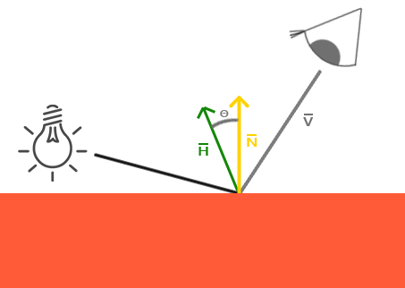
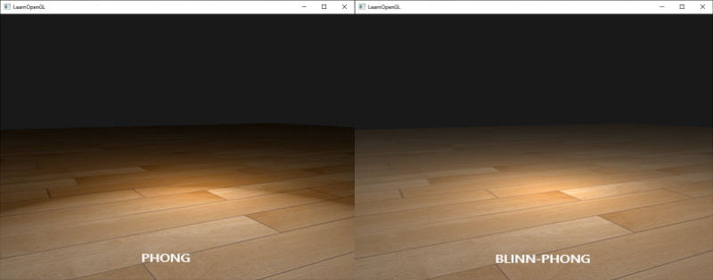
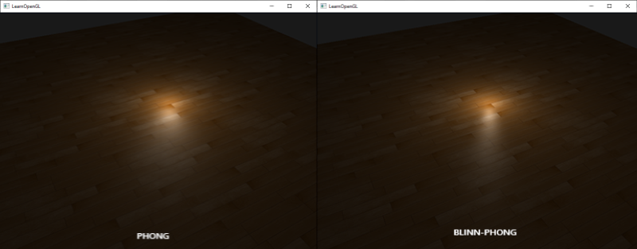

# 고급 조명

조명 관련 장에서 우리는 장면에 기본적인 사실감을 더하기 위해 퐁(Phong) 조명 모델을 간략하게 소개했습니다. 퐁 모델은 보기에는 좋지만, 이 장에서 중점적으로 살펴볼 몇 가지 미묘한 차이가 있습니다.

## 블린-퐁

퐁 라이팅은 훌륭하고 매우 효율적인 조명 근사치이지만, 특정 조건, 특히 광택 속성이 낮아져 넓고 거친 반사 영역이 생길 때 반사광 표현이 제대로 되지 않습니다. 아래 이미지는 평평한 텍스처 평면에 반사광 광택 지수를 1.0으로 설정했을 때 발생하는 현상을 보여줍니다.


가장자리 부분을 보면 반사 영역이 바로 잘려나가는 것을 알 수 있습니다. 이렇게 되는 이유는 시점 벡터와 반사 벡터 사이의 각도가 90도를 넘지 않기 때문입니다. 각도가 90도보다 크면 내적 값이 음수가 되어 반사 지수가 0.0이 됩니다. 아마도 90도보다 큰 각도의 빛은 어차피 들어오지 않으니 문제가 되지 않을 거라고 생각하실 수도 있겠죠?

틀렸습니다. 이는 확산광 성분에만 적용되는데, 법선과 광원 사이의 각도가 90도보다 크면 광원이 조명되는 표면 아래에 있다는 의미이므로 빛의 확산 기여도는 0.0이 되어야 합니다. 하지만 반사광의 경우, 광원과 법선 사이의 각도가 아니라 시점 벡터와 반사 벡터 사이의 각도를 측정합니다. 다음 두 이미지를 참조하세요.


여기서 문제가 명확해집니다. 왼쪽 이미지는 $\theta$가 90도 미만인 익숙한 퐁 반사를 보여줍니다. 오른쪽 이미지에서는 시점 벡터와 반사 벡터 사이의 각도 $\theta$가 90도보다 커서 반사광이 상쇄되는 것을 볼 수 있습니다. 일반적으로 시점 방향과 반사 방향이 멀리 떨어져 있기 때문에 문제가 되지 않지만, 반사 지수를 낮게 설정하면 반사 반경이 충분히 커져 이러한 조건에서도 반사광이 발생하게 됩니다. 90도보다 큰 각도에서 반사광이 상쇄되면서 첫 번째 이미지에서 볼 수 있는 것과 같은 아티팩트가 나타나는 것입니다.

1977년 제임스 F. 블린은 기존에 사용하던 퐁 셰이딩을 확장하여 **블린-퐁(Blinn-Phong)**{:.g} 셰이딩 모델을 도입했습니다. 블린-퐁 모델은 대체로 유사하지만, 반사광 모델을 구현하는 방식이 약간 달라 기존 문제를 해결합니다. 반사 벡터 대신 시점 방향과 광원 방향의 정확히 중간에 위치한 단위 벡터인 **중간 벡터(halfway vector)**{:.g}를 사용합니다. 이 중간 벡터가 표면의 법선 벡터에 가까울수록 반사광의 기여도가 높아집니다.



시점 방향이 (가상의) 반사 벡터와 완벽하게 일치할 때, 중간 벡터는 법선 벡터와 완벽하게 일치합니다. 시점 방향이 원래 반사 방향에 가까울수록 반사광이 더 강해집니다.

여기서 볼 수 있듯이, 보는 방향에 관계없이 중간 벡터와 표면 법선 사이의 각도는 90도를 넘지 않습니다(물론 빛이 표면보다 훨씬 아래에 있는 경우는 제외). 결과는 퐁 반사와는 약간 다르지만, 특히 반사 지수가 낮을수록 시각적으로 더 자연스럽습니다. 블린-퐁 셰이딩 모델은 또한 초기 OpenGL의 고정 함수 파이프라인에서 사용되었던 바로 그 셰이딩 모델입니다.

중간 벡터를 구하는 것은 간단합니다. 광원의 방향 벡터와 시점 벡터를 더한 다음 결과를 정규화하면 됩니다.

\[
\bar{H} = \frac{\bar{L} + \bar{V}}{||\bar{L} + \bar{V}||}
\]

이는 다음과 같은 GLSL 코드로 변환됩니다.

```glsl
vec3 lightDir   = normalize(lightPos - FragPos);
vec3 viewDir    = normalize(viewPos - FragPos);
vec3 halfwayDir = normalize(lightDir + viewDir);
```

그러면 반사광 항의 실제 계산은 표면 법선과 중간 벡터 사이의 내적을 제한하여 두 벡터 사이의 코사인 각도를 구하고, 이 각도를 다시 반사광 지수로 거듭제곱하는 방식으로 이루어집니다.

```glsl
float spec = pow(max(dot(normal, halfwayDir), 0.0), shininess);
vec3 specular = lightColor * spec;
```

블린-퐁 보정은 방금 설명한 내용 외에는 특별한 것이 없습니다. 블린-퐁 보정과 퐁 반사 보정의 유일한 차이점은 이제 시점 벡터와 반사 벡터 사이의 각도 대신 법선 벡터와 중간 벡터 사이의 각도를 측정한다는 점입니다.

중간 벡터를 도입함으로써 퐁 셰이딩의 반사광 차단 문제를 더 이상 겪지 않게 되었습니다. 아래 이미지는 반사광 지수 0.5에서 두 방법의 반사광 영역을 보여줍니다.



퐁 셰이딩과 블린-퐁 셰이딩의 또 다른 미묘한 차이점은 중간 벡터와 표면 법선 사이의 각도가 시점 벡터와 반사 벡터 사이의 각도보다 짧은 경우가 많다는 것입니다. 따라서 퐁 셰이딩과 유사한 효과를 얻으려면 반사광 지수를 약간 더 높게 설정해야 합니다. 일반적으로 퐁 셰이딩의 반사광 지수의 2~4배 정도로 설정하는 것이 좋습니다.

아래는 퐁 지수를 8.0으로, 블린-퐁 구성요소를 32.0으로 설정했을 때 두 반사 모델을 비교한 것입니다.



보시다시피 블린-퐁 반사 지수는 퐁 셰이딩보다 약간 더 선명합니다. 일반적으로 퐁 셰이딩에서 얻었던 것과 유사한 결과를 얻으려면 약간의 조정이 필요합니다. 하지만 블린-퐁 셰이딩은 기본 퐁 셰이딩보다 일반적으로 더 사실적이므로 그럴 만한 가치가 있습니다.

여기서는 일반적인 퐁 반사와 블린-퐁 반사 사이를 전환하는 간단한 프래그먼트 셰이더를 사용했습니다.

```glsl
void main()
{
    [...]
    float spec = 0.0;
    if(blinn)
    {
        vec3 halfwayDir = normalize(lightDir + viewDir);  
        spec = pow(max(dot(normal, halfwayDir), 0.0), 16.0);
    }
    else
    {
        vec3 reflectDir = reflect(-lightDir, normal);
        spec = pow(max(dot(viewDir, reflectDir), 0.0), 8.0);
    }
```

[여기](https://github.com/JoeyDeVries/LearnOpenGL/blob/master/src/5.advanced_lighting/1.advanced_lighting/advanced_lighting.cpp)에서 간단한 데모의 소스 코드를 찾을 수 있습니다. 'b' 키를 누르면 데모가 퐁 조명에서 블린-퐁 조명으로, 또는 그 반대로 전환됩니다.

