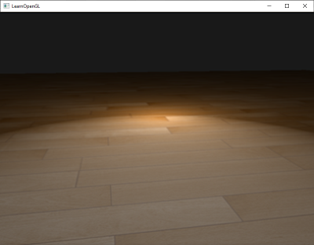

# 고급 조명

조명 관련 장에서 우리는 장면에 기본적인 사실감을 더하기 위해 퐁(Phong) 조명 모델을 간략하게 소개했습니다. 퐁 모델은 보기에는 좋지만, 이 장에서 중점적으로 살펴볼 몇 가지 미묘한 차이가 있습니다.

## Blinn-Phong

퐁 라이팅은 훌륭하고 매우 효율적인 조명 근사치이지만, 특정 조건, 특히 광택 속성이 낮아져 넓고 거친 반사 영역이 생길 때 반사광 표현이 제대로 되지 않습니다. 아래 이미지는 평평한 텍스처 평면에 반사광 광택 지수를 1.0으로 설정했을 때 발생하는 현상을 보여줍니다.

가장자리 부분을 보면 반사 영역이 바로 잘려나가는 것을 알 수 있습니다. 이렇게 되는 이유는 시점 벡터와 반사 벡터 사이의 각도가 90도를 넘지 않기 때문입니다. 각도가 90도보다 크면 내적 값이 음수가 되어 반사 지수가 0.0이 됩니다. 아마도 90도보다 큰 각도의 빛은 어차피 들어오지 않으니 문제가 되지 않을 거라고 생각하실 수도 있겠죠?

틀렸습니다. 이는 확산광 성분에만 적용되는데, 법선과 광원 사이의 각도가 90도보다 크면 광원이 조명되는 표면 아래에 있다는 의미이므로 빛의 확산 기여도는 0.0이 되어야 합니다. 하지만 반사광의 경우, 광원과 법선 사이의 각도가 아니라 시점 벡터와 반사 벡터 사이의 각도를 측정합니다. 다음 두 이미지를 참조하세요.