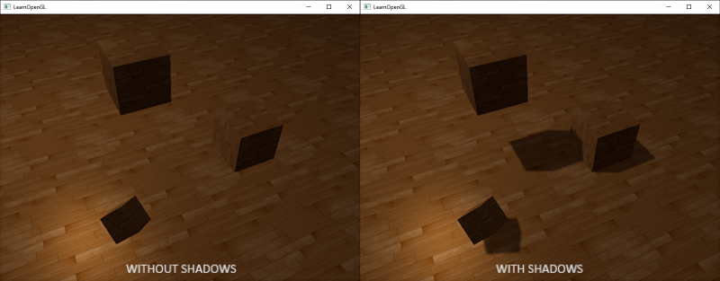
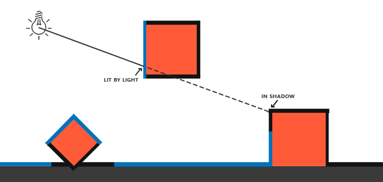

# 섀도우 매핑

그림자는 빛이 가려져서 생기는 현상입니다. 광원에서 나온 빛이 다른 물체에 가려져 어떤 물체에 닿지 ​​못하면, 그 물체는 그림자에 가려지게 됩니다. 그림자는 조명이 비추는 장면에 사실감을 더해주고, 보는 사람이 물체들 사이의 공간적 관계를 더 쉽게 파악할 수 있도록 도와줍니다. 또한 장면과 물체에 깊이감을 부여합니다. 예를 들어, 그림자가 있는 장면과 없는 장면을 다음 이미지에서 비교해 보세요.

그림자가 있으면 사물들이 서로 어떻게 관련되어 있는지 훨씬 더 명확하게 알 수 있습니다. 예를 들어, 큐브 하나가 다른 큐브들 위에 떠 있다는 사실은 그림자가 있을 때만 제대로 알아볼 수 있습니다.

그림자 구현은 다소 까다로운데, 특히 현재 실시간(래스터 그래픽) 연구에서 완벽한 그림자 알고리즘이 아직 개발되지 않았기 때문입니다. 몇 가지 훌륭한 그림자 근사 기법이 있지만, 각각 나름의 특징과 문제점이 있어 이를 고려해야 합니다.

대부분의 비디오 게임에서 사용되는 기술 중 괜찮은 결과를 내면서도 비교적 구현하기 쉬운 기술은 **섀도우 매핑**{:.g}입니다. 섀도우 매핑은 이해하기 어렵지 않고, 성능 저하도 크지 않으며, 전방향 섀도우 맵이나 계단식 섀도우 맵과 같은 고급 알고리즘으로 쉽게 확장할 수 있습니다.

## 섀도우 매핑

섀도우 매핑의 기본 개념은 매우 간단합니다. 광원의 시점에서 장면을 렌더링하면 광원이 볼 수 있는 모든 부분은 밝게 표시되고, 볼 수 없는 부분은 그림자로 처리됩니다. 예를 들어, 광원과 바닥 사이에 큰 상자가 있다고 가정해 보겠습니다. 광원은 바닥이 아닌 이 상자를 보게 되므로, 바닥 부분은 그림자로 가려져야 합니다.

여기서 파란색 선들은 광원이 볼 수 있는 프래그먼트들을 나타냅니다. 가려진 파편들은 검은색 선으로 표시되며, 그림자가 드리워진 것처럼 보입니다. 광원에서 가장 오른쪽 상자의 프래그먼트로 선이나 **광선(ray)**{:.g}을 그려보면, 광선이 가장 오른쪽 상자의 프래그먼트에 도달하기 전에 먼저 떠 있는 컨테이너에 부딪히는 것을 알 수 있습니다. 결과적으로 떠 있는 컨테이너의 프래그먼트는 빛을 받고, 가장 오른쪽 상자의 프래그먼트는 빛을 받지 못해 그림자가 드리워집니다.

우리는 광선이 처음으로 물체에 부딪힌 지점을 찾고, 이 가장 가까운 지점을 광선 상의 다른 지점들과 비교하려고 합니다. 그런 다음, 테스트 지점의 광선 위치가 가장 가까운 지점보다 광선 상에서 더 아래쪽에 있는지 확인하는 간단한 테스트를 수행합니다. 만약 그렇다면, 테스트 지점은 그림자에 가려진 것입니다. 이러한 광원에서 나오는 수천 개의 광선을 순차적으로 처리하는 것은 매우 비효율적인 접근 방식이며 실시간 렌더링에는 적합하지 않습니다. 광선을 투사하지 않고도 비슷한 작업을 수행할 수 있습니다. 대신, 우리에게 매우 익숙한 것, 바로 깊이 버퍼를 사용합니다.

깊이 테스트 챕터에서 깊이 버퍼의 값은 카메라 시점에서 [0,1] 범위로 클램핑된 프래그먼트의 깊이에 해당한다는 것을 기억하실 겁니다. 그렇다면 광원의 시점에서 장면을 렌더링하고 그 결과로 얻은 깊이 값을 텍스처에 저장하면 어떨까요? 이렇게 하면 광원의 시점에서 보이는 가장 가까운 깊이 값을 샘플링할 수 있습니다. 결국 깊이 값은 광원의 시점에서 보이는 첫 번째 프래그먼트를 나타내기 때문입니다. 우리는 이러한 모든 깊이 값을 **깊이 맵**{:.g} 또는 **섀도우 맵**{:.g}이라고 부르는 텍스처에 저장합니다.

왼쪽 이미지는 방향성 광원(모든 광선이 평행함)이 큐브 아래 표면에 그림자를 드리우는 모습을 보여줍니다. 깊이 맵에 저장된 깊이 값을 사용하여 가장 가까운 지점을 찾고, 이를 통해 프래그먼트가 그림자에 가려져 있는지 여부를 판단합니다. 깊이 맵은 광원에 특화된 뷰 행렬과 투영 행렬을 사용하여 장면을 (광원의 관점에서) 렌더링함으로써 생성됩니다. 이 투영 행렬과 뷰 행렬은 함께 변환 $T$를 형성하여 모든 3D 위치를 광원의 (가시) 좌표 공간으로 변환합니다.

!!! tip "" 
    방향광은 무한히 멀리 떨어져 있는 것으로 모델링되므로 위치를 갖지 않습니다. 하지만 그림자 매핑을 위해서는 광원의 시점에서 장면을 렌더링해야 하므로 광원의 방향을 따라 어딘가의 위치에서 장면을 렌더링해야 합니다.

