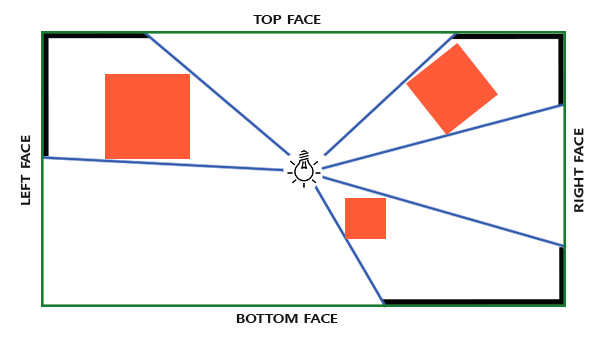

# 포인트 섀도우

지난 장에서는 섀도우 매핑을 사용하여 동적인 그림자를 만드는 방법을 배웠습니다. 이 방법은 매우 효과적이지만, 그림자가 광원 방향으로만 생성되기 때문에 주로 방향성 조명(또는 스포트라이트)에 적합합니다. 따라서 깊이(또는 그림자) 맵이 광원이 바라보는 방향에서만 생성되므로 **방향성 섀도우 매핑**{:.g}이라고도 합니다.

이 장에서는 모든 주변 방향으로 그림자를 생성하는 방법에 대해 집중적으로 다룹니다. 우리가 사용하는 기법은 점광원에 매우 적합한데, 실제 점광원은 모든 방향으로 그림자를 드리우기 때문입니다. 이 기법은 점광원 그림자 또는 이전에는 **전방향 섀도우 맵**{:.g}이라고 불렸습니다.

!!! tip ""
    이 장은 이전 장의 섀도우 매핑 내용을 바탕으로 작성되었으므로, 기존 섀도우 매핑에 익숙하지 않다면 섀도우 매핑 장을 먼저 읽는 것이 좋습니다.

이 기법은 대부분 방향성 섀도우 매핑과 유사합니다. 광원의 관점에서 깊이 맵을 생성하고, 현재 프래그먼트 위치를 기반으로 깊이 맵을 샘플링한 다음, 각 프래그먼트를 저장된 깊이 값과 비교하여 그림자에 가려져 있는지 확인합니다. 방향성 섀도우 매핑과 전방향 섀도우 매핑의 주요 차이점은 사용하는 깊이 맵입니다.

우리가 필요한 깊이 맵은 점 광원 주변의 모든 방향에서 장면을 렌더링해야 하므로 일반적인 2D 깊이 맵으로는 작동하지 않습니다. 그렇다면 큐브맵을 사용하면 어떨까요? 큐브맵은 단 6개의 면으로 전체 환경 데이터를 저장할 수 있기 때문에 전체 장면을 큐브맵의 각 면에 렌더링하고 이를 점 광원 주변의 깊이 값으로 샘플링할 수 있습니다.



생성된 깊이 큐브맵은 조명 프래그먼트 셰이더로 전달되어 방향 벡터를 사용하여 큐브맵을 샘플링하고 해당 프래그먼트에서 가장 가까운 깊이(광원의 관점에서)를 얻습니다. 복잡한 부분은 대부분 그림자 매핑 챕터에서 이미 다뤘습니다. 이 기법을 조금 더 어렵게 만드는 것은 깊이 큐브맵 생성입니다.

## 깊이 큐브맵 생성

광원 주변의 깊이 값을 나타내는 큐브맵을 생성하려면 장면을 6번 렌더링해야 합니다. 각 면마다 한 번씩 렌더링하는 것이죠. 이를 위한 한 가지 (매우 간단한) 방법은 6개의 서로 다른 뷰 행렬을 사용하여 장면을 6번 렌더링하고, 매번 다른 큐브맵 면을 프레임버퍼 객체에 연결하는 것입니다. 코드는 대략 다음과 같습니다.

```c++
for(unsigned int i = 0; i < 6; i++)
{
    GLenum face = GL_TEXTURE_CUBE_MAP_POSITIVE_X + i;
    glFramebufferTexture2D(GL_FRAMEBUFFER, GL_DEPTH_ATTACHMENT, face, depthCubemap, 0);
    BindViewMatrix(lightViewMatrices[i]);
    RenderScene();  
}
```

하지만 이 방법은 하나의 깊이 맵을 생성하는 데 많은 렌더링 호출이 필요하기 때문에 비용이 상당히 많이 들 수 있습니다. 이 장에서는 지오메트리 셰이더에서 약간의 트릭을 사용하여 단 한 번의 렌더링 패스로 깊이 큐브맵을 생성하는 대안적인(더 체계적인) 접근 방식을 사용할 것입니다.

먼저 큐브맵을 생성해야 합니다.

```c++
unsigned int depthCubemap;
glGenTextures(1, &depthCubemap);
```

그리고 각 큐브맵 면에 2D 깊이 값 텍스처 이미지를 할당합니다.

```c++
const unsigned int SHADOW_WIDTH = 1024, SHADOW_HEIGHT = 1024;
glBindTexture(GL_TEXTURE_CUBE_MAP, depthCubemap);
for (unsigned int i = 0; i < 6; ++i)
        glTexImage2D(GL_TEXTURE_CUBE_MAP_POSITIVE_X + i, 0, GL_DEPTH_COMPONENT, 
                     SHADOW_WIDTH, SHADOW_HEIGHT, 0, GL_DEPTH_COMPONENT, GL_FLOAT, NULL);
```

그리고 텍스처 매개변수를 설정하는 것을 잊지 마세요.

```c++
glTexParameteri(GL_TEXTURE_CUBE_MAP, GL_TEXTURE_MAG_FILTER, GL_NEAREST);
glTexParameteri(GL_TEXTURE_CUBE_MAP, GL_TEXTURE_MIN_FILTER, GL_NEAREST);
glTexParameteri(GL_TEXTURE_CUBE_MAP, GL_TEXTURE_WRAP_S, GL_CLAMP_TO_EDGE);
glTexParameteri(GL_TEXTURE_CUBE_MAP, GL_TEXTURE_WRAP_T, GL_CLAMP_TO_EDGE);
glTexParameteri(GL_TEXTURE_CUBE_MAP, GL_TEXTURE_WRAP_R, GL_CLAMP_TO_EDGE);  
```

원래는 큐브맵 텍스처의 단일 면을 프레임버퍼 객체에 연결하고, 매번 프레임버퍼의 깊이 버퍼 타겟을 다른 큐브맵 면으로 전환해가며 장면을 총 6번 렌더링해야 합니다. 하지만 우리는 한 번의 패스로 모든 면에 렌더링할 수 있게 해주는 지오메트리 셰이더를 사용할 것이기 때문에, `glFramebufferTexture`를 이용해 큐브맵을 프레임버퍼의 깊이 어태치먼트로 직접 연결할 수 있습니다.

```c++
glBindFramebuffer(GL_FRAMEBUFFER, depthMapFBO);
glFramebufferTexture(GL_FRAMEBUFFER, GL_DEPTH_ATTACHMENT, depthCubemap, 0);
glDrawBuffer(GL_NONE);
glReadBuffer(GL_NONE);
glBindFramebuffer(GL_FRAMEBUFFER, 0);
```

다시 한번 `glDrawBuffer`와 `glReadBuffer` 호출에 주목하세요. 깊이 큐브맵을 생성할 때는 깊이 값만 필요하므로 이 프레임 버퍼 객체가 컬러 버퍼에 렌더링하지 않는다는 것을 OpenGL에 명시적으로 알려야 합니다.

전방향 섀도우 맵을 사용하면 두 번의 렌더링 패스가 필요합니다. 첫 번째는 깊이 큐브맵을 생성하는 것이고, 두 번째는 일반 렌더링 패스에서 깊이 큐브맵을 사용하여 장면에 그림자를 추가하는 것입니다. 이 과정은 대략 다음과 같습니다.

```c++
// 1. 먼저 깊이 큐브맵을 렌더링합니다.
glViewport(0, 0, SHADOW_WIDTH, SHADOW_HEIGHT);
glBindFramebuffer(GL_FRAMEBUFFER, depthMapFBO);
    glClear(GL_DEPTH_BUFFER_BIT);
    ConfigureShaderAndMatrices();
    RenderScene();
glBindFramebuffer(GL_FRAMEBUFFER, 0);
// 2. 그런 다음 섀도우 매핑(깊이 큐브맵 사용)을 적용하여 장면을 정상적으로 렌더링합니다.
glViewport(0, 0, SCR_WIDTH, SCR_HEIGHT);
glClear(GL_COLOR_BUFFER_BIT | GL_DEPTH_BUFFER_BIT);
ConfigureShaderAndMatrices();
glBindTexture(GL_TEXTURE_CUBE_MAP, depthCubemap);
RenderScene();
```

이 과정은 기본 섀도우 매핑과 완전히 동일하지만, 이번에는 2D 깊이 텍스처 대신 큐브맵 깊이 텍스처를 렌더링하고 사용합니다.

### 빛과 공간의 변화

프레임버퍼와 큐브맵이 설정되었으므로, 이제 장면의 모든 지오메트리를 빛의 6방향 모두에 해당하는 광원 공간으로 변환하는 방법이 필요합니다. 그림자 매핑 챕터에서처럼 광원 공간 변환 행렬 $T$가 필요하지만, 이번에는 각 면마다 하나씩 필요합니다.

각 광원 공간 변환 행렬에는 투영 행렬과 시점 행렬이 모두 포함됩니다. 투영 행렬로는 원근 투영 행렬을 사용할 것입니다. 광원은 공간상의 한 점을 나타내므로 원근 투영이 가장 적합합니다. 각 광원 공간 변환 행렬은 동일한 투영 행렬을 사용합니다.

```c++
float aspect = (float)SHADOW_WIDTH/(float)SHADOW_HEIGHT;
float near = 1.0f;
float far = 25.0f;
glm::mat4 shadowProj = glm::perspective(glm::radians(90.0f), aspect, near, far);
```

여기서 중요한 점은 `glm::perspective`의 시야각 매개변수를 90도로 설정했다는 것입니다. 이 값을 90도로 설정함으로써 시야각이 큐브맵의 한 면을 정확히 채울 만큼 충분히 커지게 되어 모든 면이 가장자리에서 서로 정확하게 정렬되도록 합니다.

투영 행렬은 방향에 따라 변하지 않으므로 6개의 변환 행렬 각각에 재사용할 수 있습니다. 하지만 방향별로 다른 뷰 행렬이 필요합니다. `glm::lookAt` 함수를 사용하여 큐브맵의 각 면 방향을 순서대로 오른쪽, 왼쪽, 위쪽, 아래쪽, 가까운 쪽, 먼 쪽 순으로 바라보는 6개의 뷰 방향을 생성합니다.

```c++
std::vector<glm::mat4> shadowTransforms;
shadowTransforms.push_back(shadowProj * 
                 glm::lookAt(lightPos, lightPos + glm::vec3( 1.0, 0.0, 0.0), glm::vec3(0.0,-1.0, 0.0));
shadowTransforms.push_back(shadowProj * 
                 glm::lookAt(lightPos, lightPos + glm::vec3(-1.0, 0.0, 0.0), glm::vec3(0.0,-1.0, 0.0));
shadowTransforms.push_back(shadowProj * 
                 glm::lookAt(lightPos, lightPos + glm::vec3( 0.0, 1.0, 0.0), glm::vec3(0.0, 0.0, 1.0));
shadowTransforms.push_back(shadowProj * 
                 glm::lookAt(lightPos, lightPos + glm::vec3( 0.0,-1.0, 0.0), glm::vec3(0.0, 0.0,-1.0));
shadowTransforms.push_back(shadowProj * 
                 glm::lookAt(lightPos, lightPos + glm::vec3( 0.0, 0.0, 1.0), glm::vec3(0.0,-1.0, 0.0));
shadowTransforms.push_back(shadowProj * 
                 glm::lookAt(lightPos, lightPos + glm::vec3( 0.0, 0.0,-1.0), glm::vec3(0.0,-1.0, 0.0));
```

여기서는 6개의 뷰 행렬을 생성하고 이를 투영 행렬과 곱하여 총 6개의 서로 다른 광원 공간 변환 행렬을 얻습니다. `glm::lookAt`의 `target` 매개변수는 각각 단일 큐브맵 면의 방향을 바라봅니다.

이러한 변환 행렬은 큐브맵에 깊이 정보를 렌더링하는 셰이더로 전송됩니다.

### 깊이 셰이더

깊이 값을 깊이 큐브맵에 렌더링하려면 정점 셰이더, 프래그먼트 셰이더, 그리고 그 사이에 있는 지오메트리 셰이더, 이렇게 총 세 개의 셰이더가 필요합니다.

지오메트리 셰이더는 월드 공간의 모든 정점을 6개의 서로 다른 광원 공간으로 변환하는 역할을 담당합니다. 따라서 정점 셰이더는 단순히 정점을 월드 공간으로 변환하여 지오메트리 셰이더로 전달하는 역할을 합니다.

```c++
#version 330 core
layout (location = 0) in vec3 aPos;

uniform mat4 model;

void main()
{
    gl_Position = model * vec4(aPos, 1.0);
}  
```

기하 셰이더는 입력으로 삼각형 정점 3개와 광원 공간 변환 행렬의 균일 배열을 받습니다. 기하 셰이더는 정점을 광원 공간으로 변환하는 역할을 담당하며, 바로 이 부분이 흥미로운 부분입니다.

지오메트리 셰이더에는 프리미티브를 출력할 큐브맵 면을 지정하는 `gl_Layer`라는 내장 변수가 있습니다. 이 변수를 그대로 두면 지오메트리 셰이더는 프리미티브를 평소처럼 파이프라인의 다음 단계로 보내지만, 이 변수를 업데이트하면 각 프리미티브를 렌더링할 큐브맵 면을 제어할 수 있습니다. 물론 이 기능은 활성 프레임버퍼에 큐브맵 텍스처가 연결되어 있을 때만 작동합니다.

