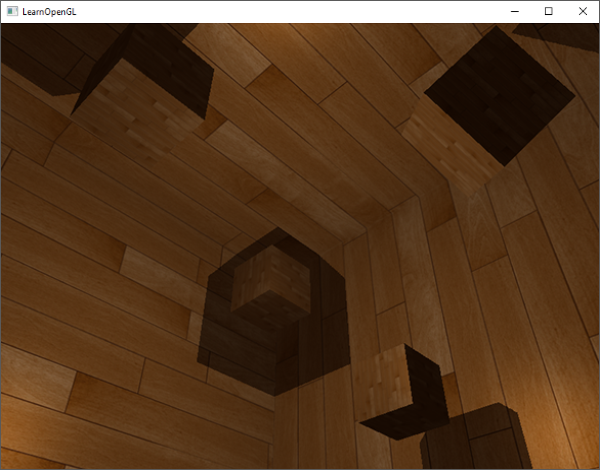

# 포인트 섀도우

지난 장에서는 섀도우 매핑을 사용하여 동적인 그림자를 만드는 방법을 배웠습니다. 이 방법은 매우 효과적이지만, 그림자가 광원 방향으로만 생성되기 때문에 주로 방향성 조명(또는 스포트라이트)에 적합합니다. 따라서 깊이(또는 그림자) 맵이 광원이 바라보는 방향에서만 생성되므로 **방향성 섀도우 매핑**{:.g}이라고도 합니다.

이 장에서는 모든 주변 방향으로 그림자를 생성하는 방법에 대해 집중적으로 다룹니다. 우리가 사용하는 기법은 점광원에 매우 적합한데, 실제 점광원은 모든 방향으로 그림자를 드리우기 때문입니다. 이 기법은 점광원 그림자 또는 이전에는 **전방향 섀도우 맵**{:.g}이라고 불렸습니다.

!!! tip ""
    이 장은 이전 장의 섀도우 매핑 내용을 바탕으로 작성되었으므로, 기존 섀도우 매핑에 익숙하지 않다면 섀도우 매핑 장을 먼저 읽는 것이 좋습니다.

이 기법은 대부분 방향성 섀도우 매핑과 유사합니다. 광원의 관점에서 깊이 맵을 생성하고, 현재 프래그먼트 위치를 기반으로 깊이 맵을 샘플링한 다음, 각 프래그먼트를 저장된 깊이 값과 비교하여 그림자에 가려져 있는지 확인합니다. 방향성 섀도우 매핑과 전방향 섀도우 매핑의 주요 차이점은 사용하는 깊이 맵입니다.

우리가 필요한 깊이 맵은 점 광원 주변의 모든 방향에서 장면을 렌더링해야 하므로 일반적인 2D 깊이 맵으로는 작동하지 않습니다. 그렇다면 큐브맵을 사용하면 어떨까요? 큐브맵은 단 6개의 면으로 전체 환경 데이터를 저장할 수 있기 때문에 전체 장면을 큐브맵의 각 면에 렌더링하고 이를 점 광원 주변의 깊이 값으로 샘플링할 수 있습니다.


생성된 깊이 큐브맵은 조명 프래그먼트 셰이더로 전달되어 방향 벡터를 사용하여 큐브맵을 샘플링하고 해당 프래그먼트에서 가장 가까운 깊이(광원의 관점에서)를 얻습니다. 복잡한 부분은 대부분 그림자 매핑 챕터에서 이미 다뤘습니다. 이 기법을 조금 더 어렵게 만드는 것은 깊이 큐브맵 생성입니다.

## 깊이 큐브맵 생성

광원 주변의 깊이 값을 나타내는 큐브맵을 생성하려면 장면을 6번 렌더링해야 합니다. 각 면마다 한 번씩 렌더링하는 것이죠. 이를 위한 한 가지 (매우 간단한) 방법은 6개의 서로 다른 뷰 행렬을 사용하여 장면을 6번 렌더링하고, 매번 다른 큐브맵 면을 프레임버퍼 객체에 연결하는 것입니다. 코드는 대략 다음과 같습니다.

```c++
for(unsigned int i = 0; i < 6; i++)
{
    GLenum face = GL_TEXTURE_CUBE_MAP_POSITIVE_X + i;
    glFramebufferTexture2D(GL_FRAMEBUFFER, GL_DEPTH_ATTACHMENT, face, depthCubemap, 0);
    BindViewMatrix(lightViewMatrices[i]);
    RenderScene();  
}
```

하지만 이 방법은 하나의 깊이 맵을 생성하는 데 많은 렌더링 호출이 필요하기 때문에 비용이 상당히 많이 들 수 있습니다. 이 장에서는 지오메트리 셰이더에서 약간의 트릭을 사용하여 단 한 번의 렌더링 패스로 깊이 큐브맵을 생성하는 대안적인(더 체계적인) 접근 방식을 사용할 것입니다.

먼저 큐브맵을 생성해야 합니다.

```c++
unsigned int depthCubemap;
glGenTextures(1, &depthCubemap);
```

그리고 각 큐브맵 면에 2D 깊이 값 텍스처 이미지를 할당합니다.

```c++
const unsigned int SHADOW_WIDTH = 1024, SHADOW_HEIGHT = 1024;
glBindTexture(GL_TEXTURE_CUBE_MAP, depthCubemap);
for (unsigned int i = 0; i < 6; ++i)
        glTexImage2D(GL_TEXTURE_CUBE_MAP_POSITIVE_X + i, 0, GL_DEPTH_COMPONENT, 
                     SHADOW_WIDTH, SHADOW_HEIGHT, 0, GL_DEPTH_COMPONENT, GL_FLOAT, NULL);
```

그리고 텍스처 매개변수를 설정하는 것을 잊지 마세요.

```c++
glTexParameteri(GL_TEXTURE_CUBE_MAP, GL_TEXTURE_MAG_FILTER, GL_NEAREST);
glTexParameteri(GL_TEXTURE_CUBE_MAP, GL_TEXTURE_MIN_FILTER, GL_NEAREST);
glTexParameteri(GL_TEXTURE_CUBE_MAP, GL_TEXTURE_WRAP_S, GL_CLAMP_TO_EDGE);
glTexParameteri(GL_TEXTURE_CUBE_MAP, GL_TEXTURE_WRAP_T, GL_CLAMP_TO_EDGE);
glTexParameteri(GL_TEXTURE_CUBE_MAP, GL_TEXTURE_WRAP_R, GL_CLAMP_TO_EDGE);  
```

원래는 큐브맵 텍스처의 단일 면을 프레임버퍼 객체에 연결하고, 매번 프레임버퍼의 깊이 버퍼 타겟을 다른 큐브맵 면으로 전환해가며 장면을 총 6번 렌더링해야 합니다. 하지만 우리는 한 번의 패스로 모든 면에 렌더링할 수 있게 해주는 지오메트리 셰이더를 사용할 것이기 때문에, `glFramebufferTexture`를 이용해 큐브맵을 프레임버퍼의 깊이 어태치먼트로 직접 연결할 수 있습니다.

```c++
glBindFramebuffer(GL_FRAMEBUFFER, depthMapFBO);
glFramebufferTexture(GL_FRAMEBUFFER, GL_DEPTH_ATTACHMENT, depthCubemap, 0);
glDrawBuffer(GL_NONE);
glReadBuffer(GL_NONE);
glBindFramebuffer(GL_FRAMEBUFFER, 0);
```

다시 한번 `glDrawBuffer`와 `glReadBuffer` 호출에 주목하세요. 깊이 큐브맵을 생성할 때는 깊이 값만 필요하므로 이 프레임 버퍼 객체가 컬러 버퍼에 렌더링하지 않는다는 것을 OpenGL에 명시적으로 알려야 합니다.

전방향 섀도우 맵을 사용하면 두 번의 렌더링 패스가 필요합니다. 첫 번째는 깊이 큐브맵을 생성하는 것이고, 두 번째는 일반 렌더링 패스에서 깊이 큐브맵을 사용하여 장면에 그림자를 추가하는 것입니다. 이 과정은 대략 다음과 같습니다.

```c++
// 1. 먼저 깊이 큐브맵을 렌더링합니다.
glViewport(0, 0, SHADOW_WIDTH, SHADOW_HEIGHT);
glBindFramebuffer(GL_FRAMEBUFFER, depthMapFBO);
    glClear(GL_DEPTH_BUFFER_BIT);
    ConfigureShaderAndMatrices();
    RenderScene();
glBindFramebuffer(GL_FRAMEBUFFER, 0);
// 2. 그런 다음 섀도우 매핑(깊이 큐브맵 사용)을 적용하여 장면을 정상적으로 렌더링합니다.
glViewport(0, 0, SCR_WIDTH, SCR_HEIGHT);
glClear(GL_COLOR_BUFFER_BIT | GL_DEPTH_BUFFER_BIT);
ConfigureShaderAndMatrices();
glBindTexture(GL_TEXTURE_CUBE_MAP, depthCubemap);
RenderScene();
```

이 과정은 기본 섀도우 매핑과 완전히 동일하지만, 이번에는 2D 깊이 텍스처 대신 큐브맵 깊이 텍스처를 렌더링하고 사용합니다.

### 빛과 공간의 변화

프레임버퍼와 큐브맵이 설정되었으므로, 이제 장면의 모든 지오메트리를 빛의 6방향 모두에 해당하는 광원 공간으로 변환하는 방법이 필요합니다. 그림자 매핑 챕터에서처럼 광원 공간 변환 행렬 $T$가 필요하지만, 이번에는 각 면마다 하나씩 필요합니다.

각 광원 공간 변환 행렬에는 투영 행렬과 시점 행렬이 모두 포함됩니다. 투영 행렬로는 원근 투영 행렬을 사용할 것입니다. 광원은 공간상의 한 점을 나타내므로 원근 투영이 가장 적합합니다. 각 광원 공간 변환 행렬은 동일한 투영 행렬을 사용합니다.

```c++
float aspect = (float)SHADOW_WIDTH/(float)SHADOW_HEIGHT;
float near = 1.0f;
float far = 25.0f;
glm::mat4 shadowProj = glm::perspective(glm::radians(90.0f), aspect, near, far);
```

여기서 중요한 점은 `glm::perspective`의 시야각 매개변수를 90도로 설정했다는 것입니다. 이 값을 90도로 설정함으로써 시야각이 큐브맵의 한 면을 정확히 채울 만큼 충분히 커지게 되어 모든 면이 가장자리에서 서로 정확하게 정렬되도록 합니다.

투영 행렬은 방향에 따라 변하지 않으므로 6개의 변환 행렬 각각에 재사용할 수 있습니다. 하지만 방향별로 다른 뷰 행렬이 필요합니다. `glm::lookAt` 함수를 사용하여 큐브맵의 각 면 방향을 순서대로 오른쪽, 왼쪽, 위쪽, 아래쪽, 가까운 쪽, 먼 쪽 순으로 바라보는 6개의 뷰 방향을 생성합니다.

```c++
std::vector<glm::mat4> shadowTransforms;
shadowTransforms.push_back(shadowProj * 
                 glm::lookAt(lightPos, lightPos + glm::vec3( 1.0, 0.0, 0.0), glm::vec3(0.0,-1.0, 0.0));
shadowTransforms.push_back(shadowProj * 
                 glm::lookAt(lightPos, lightPos + glm::vec3(-1.0, 0.0, 0.0), glm::vec3(0.0,-1.0, 0.0));
shadowTransforms.push_back(shadowProj * 
                 glm::lookAt(lightPos, lightPos + glm::vec3( 0.0, 1.0, 0.0), glm::vec3(0.0, 0.0, 1.0));
shadowTransforms.push_back(shadowProj * 
                 glm::lookAt(lightPos, lightPos + glm::vec3( 0.0,-1.0, 0.0), glm::vec3(0.0, 0.0,-1.0));
shadowTransforms.push_back(shadowProj * 
                 glm::lookAt(lightPos, lightPos + glm::vec3( 0.0, 0.0, 1.0), glm::vec3(0.0,-1.0, 0.0));
shadowTransforms.push_back(shadowProj * 
                 glm::lookAt(lightPos, lightPos + glm::vec3( 0.0, 0.0,-1.0), glm::vec3(0.0,-1.0, 0.0));
```

여기서는 6개의 뷰 행렬을 생성하고 이를 투영 행렬과 곱하여 총 6개의 서로 다른 광원 공간 변환 행렬을 얻습니다. `glm::lookAt`의 `target` 매개변수는 각각 단일 큐브맵 면의 방향을 바라봅니다.

이러한 변환 행렬은 큐브맵에 깊이 정보를 렌더링하는 셰이더로 전송됩니다.

### 깊이 셰이더

깊이 값을 깊이 큐브맵에 렌더링하려면 정점 셰이더, 프래그먼트 셰이더, 그리고 그 사이에 있는 지오메트리 셰이더, 이렇게 총 세 개의 셰이더가 필요합니다.

지오메트리 셰이더는 월드 공간의 모든 정점을 6개의 서로 다른 광원 공간으로 변환하는 역할을 담당합니다. 따라서 정점 셰이더는 단순히 정점을 월드 공간으로 변환하여 지오메트리 셰이더로 전달하는 역할을 합니다.

```glsl
#version 330 core
layout (location = 0) in vec3 aPos;

uniform mat4 model;

void main()
{
    gl_Position = model * vec4(aPos, 1.0);
}  
```

기하 셰이더는 입력으로 삼각형 정점 3개와 광원 공간 변환 행렬의 균일 배열을 받습니다. 기하 셰이더는 정점을 광원 공간으로 변환하는 역할을 담당하며, 바로 이 부분이 흥미로운 부분입니다.

지오메트리 셰이더에는 프리미티브를 출력할 큐브맵 면을 지정하는 `gl_Layer`라는 내장 변수가 있습니다. 이 변수를 그대로 두면 지오메트리 셰이더는 프리미티브를 평소처럼 파이프라인의 다음 단계로 보내지만, 이 변수를 업데이트하면 각 프리미티브를 렌더링할 큐브맵 면을 제어할 수 있습니다. 물론 이 기능은 활성 프레임버퍼에 큐브맵 텍스처가 연결되어 있을 때만 작동합니다.

```glsl
#version 330 core
layout (triangles) in;
layout (triangle_strip, max_vertices=18) out;

uniform mat4 shadowMatrices[6];

out vec4 FragPos; // GS에서 출력되는 FragPos (이미터(emitvertex)별 출력)


void main()
{
    for(int face = 0; face < 6; ++face)
    {
        gl_Layer = face; // 렌더링할 면을 지정하는 내장 변수입니다.
        for(int i = 0; i < 3; ++i) // 각 삼각형 꼭짓점에 대해
        {
            FragPos = gl_in[i].gl_Position;
            gl_Position = shadowMatrices[face] * FragPos;
            EmitVertex();
        }    
        EndPrimitive();
    }
}
```

이 지오메트리 셰이더는 비교적 간단합니다. 삼각형을 입력으로 받아 총 6개의 삼각형(6 * 3 = 18개의 정점)을 출력합니다. 메인 함수에서는 6개의 큐브맵 면을 순회하며, 각 면의 정수 값을 gl_Layer 변수에 저장하여 출력 면으로 지정합니다. 그런 다음, 각 월드 공간 입력 정점을 해당 광원 공간으로 변환하기 위해 FragPos 변수에 면의 광원 공간 변환 행렬을 곱하여 출력 삼각형을 생성합니다. 이때, 변환된 FragPos 변수를 깊이 값을 계산하는 데 필요한 프래그먼트 셰이더로 전달합니다.

지난 장에서는 빈 프래그먼트 셰이더를 사용하고 OpenGL이 깊이 맵의 깊이 값을 계산하도록 했습니다. 이번에는 각 프래그먼트의 가장 가까운 위치와 광원의 위치 사이의 선형 거리를 계산하여 자체적인 (선형) 깊이 값을 만들어 보겠습니다. 깊이 값을 직접 계산하면 이후의 그림자 계산이 좀 더 직관적으로 이해될 것입니다.

```glsl
#version 330 core
in vec4 FragPos;

uniform vec3 lightPos;
uniform float far_plane;

void main()
{
    // 프래그먼트와 광원 사이의 거리 구하기
    float lightDistance = length(FragPos.xyz - lightPos);
    
    // far_plane으로 나누어 [0;1] 범위로 매핑
    lightDistance = lightDistance / far_plane;
    
    // 수정된 값으로 적용
    gl_FragDepth = lightDistance;
}  
```

프래그먼트 셰이더는 지오메트리 셰이더에서 반환된 FragPos, 광원의 위치 벡터, 그리고 절두체의 원거리 평면 값을 입력으로 받습니다. 여기서는 프래그먼트와 광원 사이의 거리를 [0,1] 범위로 매핑하여 프래그먼트의 깊이 값으로 사용합니다.

이 셰이더와 큐브맵이 첨부된 프레임버퍼 객체를 활성화한 상태로 장면을 렌더링하면 두 번째 패스의 그림자 계산을 위한 깊이 큐브맵이 완전히 채워진 형태로 생성됩니다.

## 전방향 섀도우 맵

모든 설정이 완료되었으므로 이제 실제 전방향 그림자를 렌더링할 차례입니다. 절차는 방향 그림자 매핑 챕터와 유사하지만, 이번에는 2D 텍스처 대신 큐브맵 텍스처를 바인딩하고 광원 투영의 원거리 평면 변수를 셰이더에 전달합니다.

```c++
glViewport(0, 0, SCR_WIDTH, SCR_HEIGHT);
glClear(GL_COLOR_BUFFER_BIT | GL_DEPTH_BUFFER_BIT);
shader.use();  
// ... 셰이더에 유니폼 값을 전달합니다(광원의 far_plane 값 포함).
glActiveTexture(GL_TEXTURE0);
glBindTexture(GL_TEXTURE_CUBE_MAP, depthCubemap);
// ... 다른 텍스처를 바인딩합니다
RenderScene();
```

여기서 `renderScene` 함수는 장면 중앙에 있는 광원을 중심으로 흩어져 있는 몇 개의 큐브로 구성된 큰 큐브 방을 렌더링합니다.

정점 셰이더와 프래그먼트 셰이더는 대부분 기존 섀도우 매핑 셰이더와 유사합니다. 차이점은 프래그먼트 셰이더에서 더 이상 광원 공간에서의 프래그먼트 위치를 필요로 하지 않는다는 것입니다. 이제 방향 벡터를 사용하여 깊이 값을 샘플링할 수 있기 때문입니다.

```glsl

#version 330 core
layout (location = 0) in vec3 aPos;
layout (location = 1) in vec3 aNormal;
layout (location = 2) in vec2 aTexCoords;

out vec2 TexCoords;

out VS_OUT {
    vec3 FragPos;
    vec3 Normal;
    vec2 TexCoords;
} vs_out;

uniform mat4 projection;
uniform mat4 view;
uniform mat4 model;

void main()
{
    vs_out.FragPos = vec3(model * vec4(aPos, 1.0));
    vs_out.Normal = transpose(inverse(mat3(model))) * aNormal;
    vs_out.TexCoords = aTexCoords;
    gl_Position = projection * view * model * vec4(aPos, 1.0);
}  
```

프래그먼트 셰이더의 블린-퐁 조명 코드는 이전과 완전히 동일하며, 마지막에 그림자 곱셈 연산이 추가됩니다.

```glsl

#version 330 core
out vec4 FragColor;

in VS_OUT {
    vec3 FragPos;
    vec3 Normal;
    vec2 TexCoords;
} fs_in;

uniform sampler2D diffuseTexture;
uniform samplerCube depthMap;

uniform vec3 lightPos;
uniform vec3 viewPos;

uniform float far_plane;

float ShadowCalculation(vec3 fragPos)
{
    [...]
}

void main()
{           
    vec3 color = texture(diffuseTexture, fs_in.TexCoords).rgb;
    vec3 normal = normalize(fs_in.Normal);
    vec3 lightColor = vec3(0.3);
    // ambient
    vec3 ambient = 0.3 * color;
    // diffuse
    vec3 lightDir = normalize(lightPos - fs_in.FragPos);
    float diff = max(dot(lightDir, normal), 0.0);
    vec3 diffuse = diff * lightColor;
    // specular
    vec3 viewDir = normalize(viewPos - fs_in.FragPos);
    vec3 reflectDir = reflect(-lightDir, normal);
    float spec = 0.0;
    vec3 halfwayDir = normalize(lightDir + viewDir);  
    spec = pow(max(dot(normal, halfwayDir), 0.0), 64.0);
    vec3 specular = spec * lightColor;    
    // calculate shadow
    float shadow = ShadowCalculation(fs_in.FragPos);                      
    vec3 lighting = (ambient + (1.0 - shadow) * (diffuse + specular)) * color;    
    
    FragColor = vec4(lighting, 1.0);
} 
```

몇 가지 미묘한 차이점이 있습니다. 조명 코드는 동일하지만, 이제 `samplerCube` 유니폼이 추가되었고, `ShadowCalculation` 함수는 광원 공간에서의 프래그먼트 위치 대신 현재 프래그먼트의 위치를 ​​인수로 받습니다. 또한 나중에 필요할 광원 절두체의 `far_plane` 값도 인수로 포함합니다.

가장 큰 차이점은 `ShadowCalculation` 함수의 내용에 있는데, 이제 깊이 값을 2D 텍스처 대신 큐브맵에서 샘플링합니다. 함수의 내용을 단계별로 살펴보겠습니다.

먼저 큐브맵의 깊이를 가져와야 합니다. 이 장의 큐브맵 부분에서 프래그먼트와 광원 위치 사이의 직선 거리를 깊이로 저장했던 것을 기억하실 겁니다. 여기서도 비슷한 방식을 사용합니다.

```glsl
float ShadowCalculation(vec3 fragPos)
{
    vec3 fragToLight = fragPos - lightPos; 
    float closestDepth = texture(depthMap, fragToLight).r;
}  
```

여기서는 프래그먼트의 위치와 광원의 위치 사이의 차이 벡터를 구하고, 이 벡터를 방향 벡터로 사용하여 큐브맵을 샘플링합니다. 방향 벡터는 큐브맵에서 샘플링할 때 단위 벡터일 필요가 없으므로 정규화할 필요가 없습니다. 결과적으로 얻어지는 `closestDepth` 값은 광원과 가장 가까운 가시 프래그먼트 사이의 정규화된 깊이 값입니다.

`closestDepth` 값은 현재 [0,1] 범위에 있으므로 먼저 far_plane을 곱하여 [0,far_plane]으로 다시 변환합니다.

```glsl
closestDepth *= far_plane; 
```

다음으로 현재 프래그먼트와 광원 사이의 깊이 값을 가져옵니다. 큐브맵에서 깊이 값을 계산하는 방식 덕분에 `fragToLight`의 길이를 취하면 이 값을 쉽게 얻을 수 있습니다.

```glsl
float currentDepth = length(fragToLight);  
```

이 함수는 `closestDepth`와 동일하거나 더 큰 범위의 깊이 값을 반환합니다.

이제 두 깊이 값을 비교하여 어느 쪽이 더 가까운지 확인하고 현재 프래그먼트가 그림자에 가려져 있는지 판단할 수 있습니다. 또한 이전 장에서 논의했던 것처럼 그림자로 인한 섀도우 아크네가 발생하지 않도록 그림자 편향을 적용합니다.

```glsl
float bias = 0.05; 
float shadow = currentDepth -  bias > closestDepth ? 1.0 : 0.0; 
```

그러면 전체 그림자 계산은 다음과 같습니다.

```glslfloat ShadowCalculation(vec3 fragPos)
{
    // 프래그먼트 위치와 광원 위치 사이의 벡터를 구합니다.
    vec3 fragToLight = fragPos - lightPos;
    // 깊이 맵에서 샘플링하기 위해 광원-분할 벡터를 사용합니다.    
    float closestDepth = texture(depthMap, fragToLight).r;
    // 현재 값은 [0,1] 사이의 선형 범위에 있습니다. 원래 값으로 다시 변환합니다.
    closestDepth *= far_plane;
    // 이제 프래그먼트와 광원 위치 사이의 길이를 현재 선형 깊이로 구합니다.
    float currentDepth = length(fragToLight);
    // 이제 그림자를 테스트해 보세요
    float bias = 0.05; 
    float shadow = currentDepth -  bias > closestDepth ? 1.0 : 0.0;

    return shadow;
} 
```

이 셰이더들을 사용하면 이미 상당히 좋은 그림자를 얻을 수 있는데, 이번에는 점광원에서 나오는 빛을 중심으로 주변 모든 방향에 그림자가 생깁니다. 간단한 장면의 중앙에 점광원을 배치하면 다음과 같은 모습이 될 것입니다.



이 데모의 소스 코드는 [여기](https://github.com/JoeyDeVries/LearnOpenGL/blob/master/src/5.advanced_lighting/3.2.1.point_shadows/point_shadows.cpp)에서 찾을 수 있습니다.

### 큐브맵 깊이 버퍼 시각화

저와 비슷하시다면 아마 처음에는 제대로 되지 않았을 테니 디버깅을 해보는 게 좋을 겁니다. 가장 기본적인 확인 사항 중 하나는 깊이 맵이 올바르게 생성되었는지 확인하는 것입니다. 깊이 버퍼를 시각화하는 간단한 방법은 `ShadowCalculation` 함수의 `closestDepth` 변수를 가져와서 다음과 같이 표시하는 것입니다.

```glsl
FragColor = vec4(vec3(closestDepth / far_plane), 1.0);  
```

그 결과, 각 색상이 장면의 선형 깊이 값을 나타내는 회색 장면이 생성됩니다.

[](../../static/point_shadows_depth_cubemap.png)

바깥쪽 벽에 그림자가 생길 영역도 확인할 수 있습니다. 만약 비슷하게 보인다면, 깊이 큐브맵이 제대로 생성된 것입니다.

## PCF

전방향 섀도우 맵은 기존 섀도우 매핑과 동일한 원리를 기반으로 하므로 해상도에 따라 달라지는 아티팩트가 발생합니다. 충분히 확대하면 다시 들쭉날쭉한 가장자리를 확인할 수 있습니다. **PCF(Percentage-Closer Filtering, 백분율 근접 필터링)**{:.g}는 파편 위치 주변의 여러 샘플을 필터링하고 결과를 평균화하여 이러한 들쭉날쭉한 가장자리를 부드럽게 만듭니다.

이전 장에서 다룬 간단한 PCF 필터에 세 번째 차원을 추가하면 다음과 같습니다.

```glsl
float shadow  = 0.0;
float bias    = 0.05; 
float samples = 4.0;
float offset  = 0.1;
for(float x = -offset; x < offset; x += offset / (samples * 0.5))
{
    for(float y = -offset; y < offset; y += offset / (samples * 0.5))
    {
        for(float z = -offset; z < offset; z += offset / (samples * 0.5))
        {
            float closestDepth = texture(depthMap, fragToLight + vec3(x, y, z)).r; 
            closestDepth *= far_plane;   // undo mapping [0;1]
            if(currentDepth - bias > closestDepth)
                shadow += 1.0;
        }
    }
}
shadow /= (samples * samples * samples);
```

이 코드는 기존의 섀도우 매핑 코드와 크게 다르지 않습니다. 고정된 샘플 수를 기반으로 각 축에 대한 텍스처 오프셋을 동적으로 계산하고 더합니다. 각 샘플에 대해 오프셋된 샘플 방향에 대해 원래의 섀도우 프로세스를 반복하고 마지막에 결과를 평균냅니다.

이제 그림자가 더 부드럽고 매끄러워 보이며, 더욱 자연스러운 결과를 보여줍니다.

[](../../static/point_shadows_soft.png)

하지만 샘플 수를 4.0으로 설정하면 각 프래그먼트당 총 64개의 샘플을 추출하게 되는데, 이는 상당히 많은 양입니다!

대부분의 샘플이 원래 방향 벡터에 가까운 위치에서 샘플링되어 중복되므로, 샘플 방향 벡터에 수직인 방향으로만 샘플링하는 것이 더 효율적일 수 있습니다. 그러나 어떤 하위 방향이 중복되는지 쉽게 파악할 방법이 없기 때문에 이 방법은 어렵습니다. 한 가지 방법은 서로 완전히 다른 방향을 가리키는, 대략적으로 분리 가능한 오프셋 방향들의 배열을 사용하는 것입니다. 이렇게 하면 서로 가까운 하위 방향의 수를 크게 줄일 수 있습니다. 아래는 최대 20개의 오프셋 방향으로 구성된 배열입니다.

```glsl
vec3 sampleOffsetDirections[20] = vec3[]
(
   vec3( 1,  1,  1), vec3( 1, -1,  1), vec3(-1, -1,  1), vec3(-1,  1,  1), 
   vec3( 1,  1, -1), vec3( 1, -1, -1), vec3(-1, -1, -1), vec3(-1,  1, -1),
   vec3( 1,  1,  0), vec3( 1, -1,  0), vec3(-1, -1,  0), vec3(-1,  1,  0),
   vec3( 1,  0,  1), vec3(-1,  0,  1), vec3( 1,  0, -1), vec3(-1,  0, -1),
   vec3( 0,  1,  1), vec3( 0, -1,  1), vec3( 0, -1, -1), vec3( 0,  1, -1)
); 
```

이를 통해 PCF 알고리즘을 수정하여 `sampleOffsetDirections`에서 고정된 개수의 샘플을 추출하고, 이 샘플들을 사용하여 큐브맵을 샘플링할 수 있습니다. 이렇게 하면 시각적으로 유사한 결과를 얻는 데 필요한 샘플 수가 훨씬 줄어듭니다.

```glsl

float shadow = 0.0;
float bias   = 0.15;
int samples  = 20;
float viewDistance = length(viewPos - fragPos);
float diskRadius = 0.05;
for(int i = 0; i < samples; ++i)
{
    float closestDepth = texture(depthMap, fragToLight + sampleOffsetDirections[i] * diskRadius).r;
    closestDepth *= far_plane;   // undo mapping [0;1]
    if(currentDepth - bias > closestDepth)
        shadow += 1.0;
}
shadow /= float(samples); 
```

여기서는 큐브맵에서 샘플링하기 위해 원래 `fragToLight` 방향 벡터 주변에 `diskRadius`만큼 확대된 여러 오프셋을 추가합니다.

여기서 적용할 수 있는 또 다른 흥미로운 기법은 뷰어와 프래그먼트 사이의 거리에 따라 `diskRadius`를 변경하여 멀리 있을 때는 그림자를 부드럽게, 가까이 있을 때는 더 선명하게 만드는 것입니다.

```glsl
float diskRadius = (1.0 + (viewDistance / far_plane)) / 25.0;  
```

업데이트된 PCF 알고리즘의 결과는 부드러운 그림자 표현에서 이전과 같거나 더 나은 결과를 보여줍니다.

[](../../static/point_shadows_soft_better.png)

물론, 각 샘플에 추가하는 편향(bias)은 맥락에 따라 크게 달라지므로 작업 중인 장면에 맞춰 항상 조정이 필요합니다. 모든 값을 바꿔가며 장면에 어떤 영향을 미치는지 확인해 보세요.

최종 코드는 여기에서 확인할 수 있습니다.

참고로, 지오메트리 셰이더를 사용하여 깊이 맵을 생성하는 것이 각 면에 대해 장면을 6번 렌더링하는 것보다 반드시 빠른 것은 아닙니다. 이처럼 지오메트리 셰이더를 사용하는 방식에는 성능 저하가 따르며, 이로 인해 얻는 성능 향상 효과가 상쇄될 수도 있습니다. 물론 이는 환경, 특정 비디오 카드 드라이버, 그리고 기타 여러 요인에 따라 달라집니다. 따라서 시스템 성능을 최대한 활용하고 싶다면 두 가지 방식을 모두 프로파일링하여 더 효율적인 방법을 선택하는 것이 좋습니다.

## Additional resources

 - [Multipass Shadow Mapping With Point Lights](http://ogldev.atspace.co.uk/www/tutorial43/tutorial43.html): omnidirectional shadow mapping tutorial by ogldev.
 - [Omni-directional Shadows](http://www.cg.tuwien.ac.at/~husky/RTR/OmnidirShadows-whyCaps.pdf): a nice set of slides about omnidirectional shadow mapping by Peter Houska.
