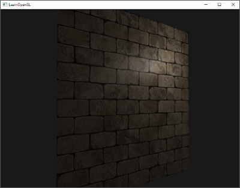
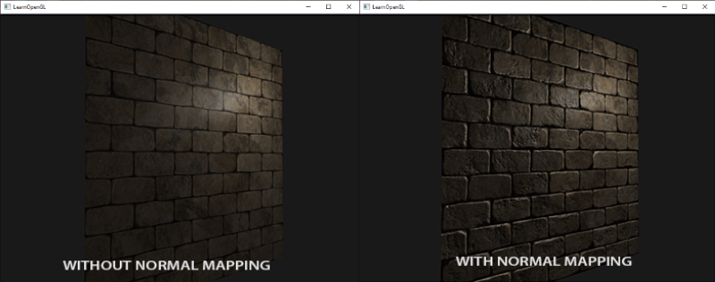
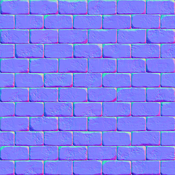
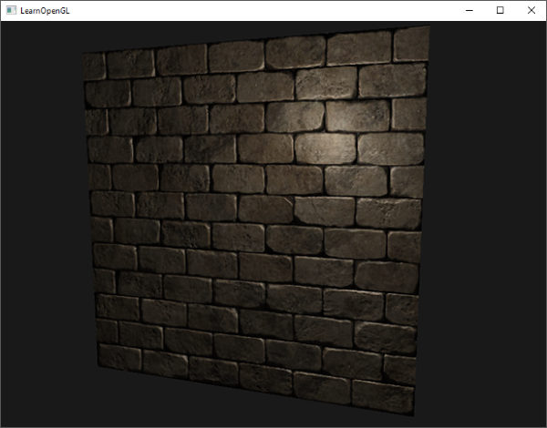
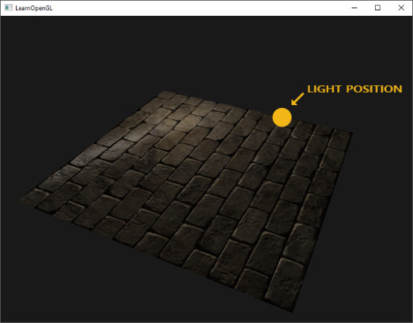
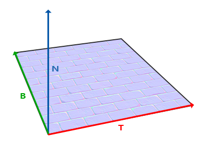
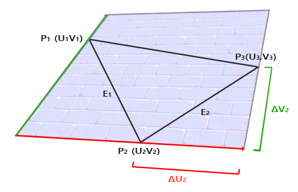

# 노멀 매핑

모든 장면은 수백, 많게는 수천 개의 삼각형으로 이루어진 메시로 가득 차 있습니다. 이러한 평면 삼각형에 2D 텍스처를 입혀 폴리곤이 작은 평면 삼각형이라는 사실을 감춰 사실감을 높였습니다. 텍스처가 도움이 되긴 하지만, 메시를 자세히 살펴보면 여전히 평평한 표면이 눈에 띕니다. 하지만 실제 표면은 대부분 평평하지 않고 울퉁불퉁한 디테일을 가지고 있습니다.

예를 들어 벽돌 표면을 생각해 보세요. 벽돌 표면은 상당히 거칠고 완전히 평평하지 않습니다. 움푹 들어간 시멘트 줄무늬와 수많은 작은 구멍과 균열이 있습니다. 만약 이러한 벽돌 표면을 조명이 비추는 장면에서 본다면 몰입감이 쉽게 깨집니다. 아래 이미지에서 점광원에 의해 조명된 평평한 표면에 벽돌 텍스처가 적용된 것을 볼 수 있습니다. 



조명 시스템은 작은 균열이나 구멍을 전혀 고려하지 않고 벽돌 사이의 깊은 줄무늬도 완전히 무시합니다. 표면이 완벽하게 평평해 보입니다. 스페큘러 맵을 사용하여 깊이나 다른 디테일 때문에 일부 표면이 덜 밝게 보이도록 하면 평평한 느낌을 어느 정도 해결할 수 있지만, 이는 근본적인 해결책이라기보다는 임시방편에 가깝습니다. 우리에게 필요한 것은 표면의 미세한 깊이감과 같은 디테일을 조명 시스템에 알려주는 방법입니다.

빛의 관점에서 생각해 보면, 표면이 어떻게 완전히 평평한 표면처럼 조명될까요? 그 답은 표면의 법선 벡터에 있습니다. 조명 기법의 관점에서 물체의 형태를 결정하는 유일한 방법은 물체에 수직인 법선 벡터를 이용하는 것입니다. 벽돌 표면은 하나의 법선 벡터만 가지고 있기 때문에, 이 법선 벡터의 방향에 따라 표면 전체가 균일하게 보여집니다. 그렇다면 각 프래그먼트마다 동일한 법선 벡터를 사용하는 대신, 각 프래그먼트마다 다른 법선 벡터를 사용하면 어떨까요? 이렇게 하면 표면의 미세한 디테일에 따라 법선 벡터를 조금씩 다르게 설정할 수 있습니다. 이는 표면이 훨씬 더 복잡해 보이는 착시 효과를 만들어냅니다. 


프래그먼트별 노멀을 사용하면 조명이 표면이 (노멀 벡터에 수직인) 아주 작은 평면들로 구성되어 있다고 착각하게 만들어 표면의 디테일을 크게 향상시킬 수 있습니다. 표면별 노멀 대신 프래그먼트별 노멀을 사용하는 이 기법을 노멀 매핑 또는 범프 매핑이라고 합니다. 벽돌 평면에 적용하면 다음과 같습니다.



보시다시피, 이 방법은 상대적으로 낮은 비용으로 디테일을 크게 향상시켜 줍니다. 프래그먼트별로 법선 벡터만 변경하기 때문에 조명 방정식을 수정할 필요가 없습니다. 이제 보간된 표면 법선 대신 프래그먼트별 법선을 조명 알고리즘에 전달합니다. 그러면 조명 알고리즘이 나머지를 처리합니다.

## 노멀 매핑

노멀 매핑을 제대로 작동시키려면 프래그먼트별 노멀이 필요합니다. 디퓨즈 맵과 스페큘러 맵에서 했던 것처럼 2D 텍스처를 사용하여 프래그먼트별 노멀 데이터를 저장할 수 있습니다. 이렇게 하면 2D 텍스처를 샘플링하여 특정 프래그먼트에 대한 노멀 벡터를 얻을 수 있습니다.

법선 벡터는 기하학적 요소이고 텍스처는 일반적으로 색상 정보만 저장하는 데 사용되지만, 텍스처에 법선 벡터를 저장하는 것이 직관적이지 않을 수 있습니다. 텍스처의 색상 벡터를 생각해 보면, 색상 벡터는 r, g, b 성분을 가진 3D 벡터로 표현됩니다. 마찬가지로 법선 벡터의 x, y, z 성분을 각각의 색상 성분에 저장할 수 있습니다. 법선 벡터는 -1에서 1 사이의 값을 가지므로 먼저 [0,1] 범위로 매핑합니다.


```glsl
vec3 rgb_normal = normal * 0.5 + 0.5; // transforms from [-1,1] to [0,1]  
```

이처럼 일반 벡터를 RGB 색상 구성 요소로 변환하면 표면 모양에서 파생된 프래그먼트별 법선을 2D 텍스처에 저장할 수 있습니다. 이 장의 시작 부분에 나오는 벽돌 표면의 노멀 맵 예시는 아래와 같습니다.



이 노멀 맵(그리고 온라인에서 찾을 수 있는 거의 모든 노멀 맵)은 푸른빛을 띕니다. 이는 모든 법선 벡터가 양의 z축(0,0,1) 방향으로 향하고 있기 때문이며, 이 방향은 푸른색을 띕니다. 색상의 차이는 일반적인 양의 z축 방향에서 약간 벗어난 법선 벡터를 나타내며, 텍스처에 깊이감을 부여합니다. 예를 들어, 각 벽돌의 윗면은 녹색을 띠는 경향이 있는데, 이는 벽돌 윗면의 법선 벡터가 양의 y축 방향(0,1,0)을 더 많이 가리키고 있기 때문이며, 이 방향은 녹색에 해당합니다!

양의 z축을 바라보는 단순한 평면을 사용하여 [이 확산 텍스처](../static/brickwall.jpg)와 [이 노멀 맵](../static/brickwall_normal.jpg)을 통해 이전 섹션의 이미지를 렌더링할 수 있습니다. 링크된 노멀 맵은 위에 표시된 것과 다릅니다. 그 이유는 OpenGL이 텍스처 좌표를 읽을 때 y(또는 v) 좌표가 일반적으로 텍스처가 생성되는 방식과 반전되어 있기 때문입니다. 따라서 링크된 노멀 맵의 y(또는 녹색) 성분이 반전되어 있습니다(녹색이 이제 아래쪽을 향하는 것을 볼 수 있습니다). 이를 고려하지 않으면 조명이 잘못 표현될 수 있습니다. 두 텍스처를 모두 로드하고 적절한 텍스처 유닛에 바인딩한 다음, 조명 프래그먼트 셰이더에서 다음과 같이 변경하여 평면을 렌더링합니다.

```glsl
uniform sampler2D normalMap;  

void main()
{           
    // [0,1] 범위의 노멀 맵에서 노멀을 추출합니다.
    normal = texture(normalMap, fs_in.TexCoords).rgb;
    // 법선 벡터를 [-1,1] 범위로 변환합니다.
    normal = normalize(normal * 2.0 - 1.0);   
  
    [...]
    // 평소처럼 조명을 진행하세요
}  
```

여기서는 법선을 RGB 색상으로 매핑하는 과정을 역으로 수행합니다. 즉, 샘플링된 법선 색상을 [0,1]에서 [-1,1]로 다시 매핑한 다음, 샘플링된 법선 벡터를 후속 조명 계산에 사용합니다. 이 경우 블린-퐁 셰이더를 사용했습니다.

시간에 따라 광원을 천천히 이동시키면 노멀 맵을 사용하여 깊이감을 효과적으로 표현할 수 있습니다. 이 노멀 매핑 예제를 실행하면 이 장의 시작 부분에 나와 있는 것과 정확히 같은 결과가 나타납니다.



하지만 한 가지 문제가 있어 노멀 맵의 활용이 크게 제한됩니다. 우리가 사용한 노멀 맵의 법선 벡터는 모두 양의 z 방향을 향하고 있었습니다. 이는 평면의 표면 법선 벡터 또한 양의 z 방향을 향하고 있었기 때문에 가능했습니다. 그러나 만약 평면이 지면에 놓여 있고 표면 법선 벡터가 양의 y 방향을 향하고 있다면, 동일한 노멀 맵을 어떻게 적용해야 할까요?



조명이 제대로 나오지 않네요! 이는 이 평면의 샘플링된 법선 벡터가 여전히 대략 양의 z 방향을 가리키고 있기 때문입니다. 실제로는 양의 y 방향을 가리켜야 하는데 말이죠. 결과적으로 조명 시스템은 평면의 법선 벡터가 이전에 평면이 양의 z 방향을 가리켰을 때와 동일하다고 판단하여 잘못된 조명을 적용합니다. 아래 이미지는 이 표면에서 샘플링된 법선 벡터가 대략 어떻게 보이는지 보여줍니다.


보시다시피 모든 법선 벡터가 양의 y 방향을 향해야 함에도 불구하고 양의 z 방향을 어느 정도 향하고 있습니다. 이 문제를 해결하는 한 가지 방법은 표면의 가능한 모든 방향에 대해 법선 맵을 정의하는 것입니다. 정육면체의 경우 6개의 법선 맵이 필요합니다. 그러나 표면 방향이 수백 개 이상일 수 있는 복잡한 메시의 경우 이 방법은 현실적으로 불가능합니다.

다른 해결책으로는 조명 처리를 다른 좌표 공간에서 수행하는 방법이 있습니다. 이 좌표 공간에서는 법선 맵 벡터가 항상 양의 z 방향을 향하고, 다른 모든 조명 벡터는 이 양의 z 방향을 기준으로 변환됩니다. 이렇게 하면 방향에 관계없이 항상 동일한 법선 맵을 사용할 수 있습니다. 이 좌표 공간을 **탄젠트 공간(tangent space)**{:.g}이라고 합니다.

## 탄젠트 공간

노멀 맵의 법선 벡터는 탄젠트 공간으로 표현되며, 이 공간에서 법선은 항상 대략 양의 z 방향을 가리킵니다. 탄젠트 공간은 삼각형 표면에 국한된 공간으로, 법선은 각 삼각형의 로컬 기준 좌표계에 상대적입니다. 즉, 노멀 맵 벡터의 로컬 공간이라고 생각하면 됩니다. 최종 변환 방향과 관계없이 모든 벡터는 양의 z 방향을 가리키도록 정의됩니다. 특정 행렬을 사용하면 이 로컬 탄젠트 공간의 법선 벡터를 월드 좌표계 또는 뷰 좌표계로 변환하여 최종 매핑된 표면의 방향을 따라 정렬할 수 있습니다.

이전 섹션에서 살펴본 것처럼 양의 y 방향을 바라보는 잘못된 노멀 맵이 적용된 표면이 있다고 가정해 보겠습니다. 노멀 맵은 탄젠트 공간에서 정의되므로, 이 문제를 해결하는 한 가지 방법은 탄젠트 공간의 노멀 벡터를 다른 공간으로 변환하는 행렬을 계산하는 것입니다. 이렇게 하면 노멀 벡터들이 표면의 법선 방향과 정렬되어 모든 노멀 벡터가 대략 양의 y 방향을 가리키게 됩니다. 탄젠트 공간의 장점은 어떤 유형의 표면에 대해서도 이 행렬을 계산할 수 있어 탄젠트 공간의 z 방향을 표면의 법선 방향에 정확하게 맞출 수 있다는 것입니다.

이러한 행렬을 **TBN**{:.g} 행렬이라고 하며, 각 문자는 **접선(Tangent)**{:.g}, **종접선(Bitangent)**{:.g}, **법선(Normal)**{:.g} 벡터를 나타냅니다. 이 행렬을 구성하는 데 필요한 벡터는 바로 이 세 가지입니다. 탄젠트 공간 벡터를 다른 좌표 공간으로 변환하는 이러한 기저 변환 행렬을 구성하려면 법선 맵의 표면을 따라 정렬된 세 개의 수직 벡터, 즉 위쪽, 오른쪽, 앞쪽 벡터가 필요합니다. 이는 카메라 챕터에서 했던 것과 유사합니다.

우리는 이미 표면의 법선 벡터인 위쪽 벡터를 알고 있습니다. 오른쪽 벡터와 앞쪽 벡터는 각각 접선 벡터와 종접선 벡터입니다. 다음 표면 이미지는 표면 위의 세 벡터를 모두 보여줍니다.



접선 벡터와 종접선 벡터를 계산하는 것은 법선 벡터를 계산하는 것만큼 간단하지 않습니다. 이미지에서 볼 수 있듯이 법선 맵의 접선 벡터와 종접선 벡터의 방향은 표면의 텍스처 좌표를 정의하는 방향과 일치합니다. 이 사실을 이용하여 각 표면의 접선 벡터와 종접선 벡터를 계산할 것입니다. 이 벡터들을 얻으려면 약간의 수학적 계산이 필요합니다. 다음 이미지를 참조하세요.



